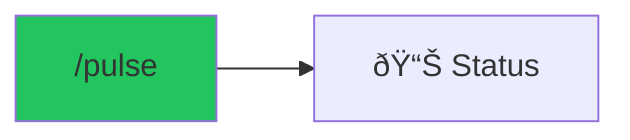

---
description: Project health dashboard. Agent status, file stats, and real-time progress tracking.
---

# /pulse - Project Health Dashboard

$ARGUMENTS

---

## Purpose

Display real-time project status including agent progress, file statistics, and preview health. **Single command for complete project visibility.**

---

## 🤖 Meta-Agents Integration

| Phase | Agent | Action |
| ----- | ----- | ------ |
| **Status Collection** | `orchestrator` | Aggregate status from all running agents |
| **Health Analysis** | `assessor` | Evaluate project health risks |
| **Trend Learning** | `learner` | Track observability over time for trend analysis |

---

## What It Shows

| Section          | Information                                   |
| ---------------- | --------------------------------------------- |
| **Project Info** | Name, path, tech stack, features              |
| **Agent Board**  | Running agents, completed tasks, pending work |
| **File Stats**   | Created/modified file counts                  |
| **Preview**      | Server URL, health status                     |

---

## Technical

### Get Status

// turbo

```bash
node .agent/scripts-js/session_manager.js status
# OR: npm run session:status
```

### Check Preview

// turbo

```bash
node .agent/scripts-js/auto_preview.js status
# OR: npm run preview:status
```

---

## 📊 observability DASHBOARD (FAANG+)

### Collect observability

// turbo

```bash
node .agent/scripts-js/observability-collector.js collect
```

### Show Current observability

// turbo

```bash
node .agent/scripts-js/observability-collector.js show
```

### Show 7-Day Trends

// turbo

```bash
node .agent/scripts-js/observability-collector.js trends
```

### Dashboard Output

```
┌─────────────────────────────────────────┐
│  📊 Project observability Dashboard           │
├─────────────────────────────────────────┤
│  Build Time:    2.3s (↓ 15%)           │
│  Bundle Size:   245KB (stable)          │
│  Source Files:  142                     │
│  Test Coverage: 87% (↑ 3%)             │
│  Lighthouse:    92/100                  │
│  Security:      0 vulnerabilities       │
├─────────────────────────────────────────┤
│  7-Day Trend: ▁▂▃▄▅▆▇█                  │
└─────────────────────────────────────────┘
```

### KPI Thresholds

| Metric        | Good    | Warning   | Critical |
| ------------- | ------- | --------- | -------- |
| Build Time    | < 5s    | 5-15s     | > 15s    |
| Bundle Size   | < 250KB | 250-500KB | > 500KB  |
| Test Coverage | > 80%   | 60-80%    | < 60%    |
| Lighthouse    | > 90    | 70-90     | < 70     |

## Example Output

```markdown
=== Project Status ===

📁 Project: my-ecommerce
📂 Path: C:/projects/my-ecommerce
🏷️ Type: nextjs-ecommerce
📊 Status: active

🔧 Tech Stack:
Framework: next.js
Database: postgresql
Auth: clerk
Payment: stripe

✅ Features (5):
• product-listing
• cart
• checkout
• user-auth
• order-history

⏳ Pending (2):
• admin-panel
• email-notifications

📄 Files: 73 created, 12 modified

=== Agent Status ===

| Agent               | Task   | Status      |
| ------------------- | ------ | ----------- |
| database-architect  | Schema | ✅ Complete |
| backend-specialist  | API    | ✅ Complete |
| frontend-specialist | UI     | 🔄 60%      |
| test-engineer       | Tests  | ⏳ Waiting  |

=== Preview ===

🌐 URL: http://localhost:3000
💚 Health: OK
```

---

## Examples

```
/pulse
```

---

## 🔗 Workflow Chain



| After /pulse    | Run         | Purpose   |
| --------------- | ----------- | --------- |
| See issues      | `/diagnose` | Debug     |
| Ready to test   | `/validate` | Run tests |
| Ready to deploy | `/launch`   | Deploy    |

**Handoff:**

```markdown
Status: 5 features complete, preview running at localhost:3000
```

