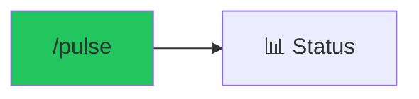

# /pulse - Project Health Dashboard

$ARGUMENTS

---

## Purpose

Display real-time project status including agent progress, file statistics, and preview health. **Single command for complete project visibility.**

---

## What It Shows

| Section | Information |
|---------|-------------|
| **Project Info** | Name, path, tech stack, features |
| **Agent Board** | Running agents, completed tasks, pending work |
| **File Stats** | Created/modified file counts |
| **Preview** | Server URL, health status |

---

## Technical

### Get Status
// turbo
```bash
python .agent/scripts/session_manager.py status
```

### Check Preview
// turbo
```bash
python .agent/scripts/auto_preview.py status
```

---

## Example Output

```markdown
=== Project Status ===

📁 Project: my-ecommerce
📂 Path: C:/projects/my-ecommerce
🏷️ Type: nextjs-ecommerce
📊 Status: active

🔧 Tech Stack:
   Framework: next.js
   Database: postgresql
   Auth: clerk
   Payment: stripe

✅ Features (5):
   • product-listing
   • cart
   • checkout
   • user-auth
   • order-history

⏳ Pending (2):
   • admin-panel
   • email-notifications

📄 Files: 73 created, 12 modified

=== Agent Status ===

| Agent | Task | Status |
|-------|------|--------|
| database-architect | Schema | ✅ Complete |
| backend-specialist | API | ✅ Complete |
| frontend-specialist | UI | 🔄 60% |
| test-engineer | Tests | ⏳ Waiting |

=== Preview ===

🌐 URL: http://localhost:3000
💚 Health: OK
```

---

## Examples

```
/pulse
```

---

## 🔗 Workflow Chain



| After /pulse | Run | Purpose |
|--------------|-----|---------|
| See issues | `/diagnose` | Debug |
| Ready to test | `/validate` | Run tests |
| Ready to deploy | `/launch` | Deploy |

**Handoff:**
```markdown
Status: 5 features complete, preview running at localhost:3000
```
