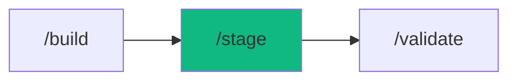

# /stage - Development Sandbox

$ARGUMENTS

---

## Purpose

Manage local development environments with multi-service orchestration — auto-detect project type, start/stop services with dependency ordering, resolve port conflicts, integrate Docker Compose for infrastructure, and monitor service health. **Differs from `/launch` (production deployment) and `/monitor` (production observability) by focusing on local development sandbox management with hot-reload and debugging support.** Uses `cicd-pipeline` with `server-ops` for service management.

---

## 🤖 Meta-Agents Integration

| Phase | Agent | Action |
| ----- | ----- | ------ |
| **Pre-Flight** | `assessor` | Evaluate environment, ports, and knowledge-compiler context |
| **Execution** | `orchestrator` | Coordinate service startup and dependency ordering |
| **Safety** | `recovery` | Save state and recover/rollback from service startup failures |
| **Post-Stage** | `learner` | Log sandbox execution telemetry and port patterns |

```
Flow:
recovery.save(server_state) → detect(project) → resolve(ports)
       ↓
assessor.evaluate(port_conflicts) → start(services)
       ↓
health_check → learner.log(config)
```

---

## Sub-Commands

| Command | Action |
|---------|--------|
| `/stage` | Show status of all services |
| `/stage start` | Start all services (smart detection) |
| `/stage start frontend` | Start specific service |
| `/stage stop` | Stop all services |
| `/stage restart` | Restart all / specific service |
| `/stage check` | Health check all services |
| `/stage logs` | Tail logs (all or specific) |
| `/stage logs api --filter error` | Filter logs |
| `/stage ports` | Show port allocation map |
| `/stage docker` | Start Docker Compose stack |
| `/stage docker down` | Stop Docker services |
| `/stage docker --profile infra` | Start only infrastructure |
| `/stage start --debug` | Start with debugging enabled |

---

## ⚡ MANDATORY: Development Sandbox Protocol

### Phase 1: Pre-flight & knowledge-compiler Context

> **Rule 0.5-K:** knowledge-compiler pattern check.

1. Read `.agent/skills/knowledge-compiler/patterns/` for past failures before proceeding.
2. Trigger `recovery` agent to run Checkpoint (`git commit -m "chore(checkpoint): pre-stage"`).

### Phase 2: Environment Detection

| Field | Value |
|-------|-------|
| **INPUT** | $ARGUMENTS (sub-command + optional service name) |
| **OUTPUT** | Project type, detected services, port assignments |
| **AGENTS** | `cicd-pipeline`, `assessor` |
| **SKILLS** | `server-ops`, `context-engineering` |

// turbo — telemetry: phase-2-detect

Auto-detect project type:

| Detected File | Service | Default Port | Start Command |
|--------------|---------|-------------|---------------|
| `next.config.*` | Next.js | 3000 | `npm run dev` |
| `vite.config.*` | Vite | 5173 | `npm run dev` |
| `nuxt.config.*` | Nuxt | 3000 | `npm run dev` |
| `package.json` (scripts.dev) | Node.js | 3001 | `npm run dev` |
| `manage.py` | Django | 8000 | `python manage.py runserver` |
| `main.py` / `app.py` | FastAPI/Flask | 8000 | `uvicorn app:app --reload` |
| `docker-compose.yml` | Docker Stack | varies | `docker compose up` |
| `prisma/schema.prisma` | Database | 5432 | `npx prisma studio` |

Monorepo detection:
```
apps/web/    → Frontend (port 3000)
apps/api/    → Backend (port 3001)
packages/db/ → Database service
```

### Phase 3: Port Resolution & Service Start

| Field | Value |
|-------|-------|
| **INPUT** | Detected services from Phase 2 |
| **OUTPUT** | Running services with resolved ports |
| **AGENTS** | `cicd-pipeline`, `orchestrator` |
| **SKILLS** | `server-ops` |

// turbo — telemetry: phase-3-start

Port allocation:

| Service | Default | Fallback Range |
|---------|---------|---------------|
| Frontend | 3000 | 3000-3009 |
| Backend API | 3001 | 3010-3019 |
| PostgreSQL | 5432 | — |
| Redis | 6379 | — |
| Prisma Studio | 5555 | 5555-5559 |
| Storybook | 6006 | 6006-6009 |

Conflict resolution:
```
Port in use?
+-- OUR process? → Reuse (already running)
+-- Another dev server? → Offer kill or next port
+-- System service? → Use fallback
```

Startup order (respecting dependencies):
```
1. Infrastructure  → Database, Redis, Queue
2. Backend         → API server, Workers
3. Frontend        → Next.js / Vite dev server
4. Tools           → Prisma Studio, Storybook
```

Docker hybrid mode (recommended):
- **Docker:** Database + Redis + Mailhog (stable infra)
- **Local:** Frontend + Backend (fast HMR, better debugging)

// turbo
```bash
npx cross-env OTEL_SERVICE_NAME="workflow:stage" TRACE_ID="$TRACE_ID" node .agent/scripts/auto_preview.ts start
```

### Phase 4: Health Monitoring

| Field | Value |
|-------|-------|
| **INPUT** | Running services from Phase 3 |
| **OUTPUT** | Health status dashboard, auto-restart on crash |
| **AGENTS** | `learner` |
| **SKILLS** | `server-ops`, `problem-checker`, `knowledge-compiler` |

// turbo — telemetry: phase-4-health

Health gates:

| Service | Wait For | Health Check |
|---------|----------|-------------|
| Database | — | TCP port open |
| Redis | — | `PING → PONG` |
| API Server | Database, Redis | `GET /health → 200` |
| Frontend | API Server | `GET / → 200` |

Auto-restart on crash: 3 retry attempts with error logging.

// turbo
```bash
npx cross-env OTEL_SERVICE_NAME="workflow:stage" TRACE_ID="$TRACE_ID" node .agent/scripts/auto_preview.ts status
```

---

## → MANDATORY: Problem Verification Before Completion

> **CRITICAL:** This check MUST be performed before any `notify_user` or task completion.

### Check @[current_problems]

```
1. Read @[current_problems] from IDE
2. If errors/warnings > 0:
   a. Auto-fix: imports, types, lint errors
   b. Re-check @[current_problems]
   c. If still > 0 → STOP → Notify user
3. If count = 0 → Proceed to completion
```

> **Note:** /stage manages services, not code. Problems are reported along with service health.

---

## 🔄 Rollback & Recovery

If port orchestration fails or Docker containers hang:
1. Trigger `recovery` meta-agent to run `docker compose down` and kill dangling Node/Python processes on target ports.
2. Automatically select random fallback ports instead of interactive resolution.
3. Restart safe baseline infrastructure without application services.

---

## Output Format

```markdown
## 🛠️ Stage Status

### Services

| Service | Port | Health | Mode |
|---------|------|--------|------|
| Frontend | 3000 | → OK | Local |
| API | 3001 | → OK | Local |
| PostgreSQL | 5432 | → OK | Docker |
| Redis | 6379 | → OK | Docker |

### URLs

| Service | URL |
|---------|-----|
| Frontend | http://localhost:3000 |
| API | http://localhost:3001 |
| Prisma Studio | http://localhost:5555 |

### Next Steps

- [ ] Test: http://localhost:3000
- [ ] Run `/validate` for tests
- [ ] Deploy with `/launch`
```

---

## Examples

```
/stage
/stage start
/stage start --debug
/stage stop
/stage restart backend
/stage check
/stage docker --profile infra
```

---

## Key Principles

- **Auto-detect** — smart project type detection, zero config needed
- **Dependency ordering** — start infra before backend before frontend
- **Docker for infra, local for code** — hybrid mode for best DX
- **Port conflict resolution** — never fail on port collision, auto-resolve
- **Health gates** — verify each service before starting dependents

---

## 🔗 Workflow Chain

**Skills Loaded (5):**

- `server-ops` - Service management, process control, port management
- `cicd-pipeline` - Docker Compose integration
- `context-engineering` - Codebase parsing and environment detection
- `problem-checker` - Service problem verification
- `knowledge-compiler` - Learning and logging sandbox patterns



| After /stage | Run | Purpose |
|-------------|-----|---------|
| Services running | `/validate` | Test against live services |
| Service crashing | `/diagnose` | Debug service failures |
| All tests pass | `/launch` | Deploy to production |

**Handoff to /validate:**

```markdown
✅ Stage running! Services: [count] active on ports [ports].
Run `/validate` to test against live services.
```
