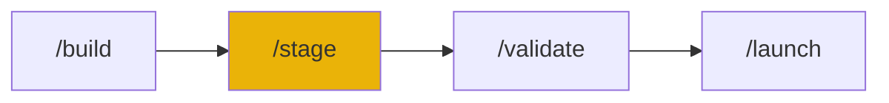

# /stage - Development Sandbox

$ARGUMENTS

---

## Purpose

Manage preview servers for local development. **Health monitoring and port conflict resolution included.**

---

## Sub-commands

```
/stage           - Show current status
/stage start     - Start server
/stage stop      - Stop server
/stage restart   - Restart
/stage check     - Health check
```

---

## Workflow

### Start Server

@auto @safe
// turbo

```bash
node .agent/scripts-js/auto_preview.js start
# OR: npm run preview:start
```

### Stop Server

@auto @safe
// turbo

```bash
node .agent/scripts-js/auto_preview.js stop
# OR: npm run preview:stop
```

### Check Status

@auto @safe
// turbo

```bash
node .agent/scripts-js/auto_preview.js status
# OR: npm run preview:status
```

---

## Output Examples

### Start Success

```markdown
🚀 Starting preview...
Port: 3000
Type: Next.js

✅ Preview ready!
URL: http://localhost:3000
```

### Status Check

```markdown
=== Preview Status ===

🌐 URL: http://localhost:3000
📁 Project: C:/projects/my-app
🏷️ Type: nextjs
💚 Health: OK
```

### Port Conflict

```markdown
⚠️ Port 3000 is in use.

Options:

1. Start on port 3001
2. Close app on 3000
3. Specify different port

Which one? (default: 1)
```

---

## Examples

```
/stage
/stage start
/stage stop
/stage restart
/stage check
```

---

## 🔗 Workflow Chain



| After /stage    | Run         | Purpose    |
| --------------- | ----------- | ---------- |
| Preview running | `/validate` | Test app   |
| Ready to deploy | `/launch`   | Production |

**Handoff to /validate:**

```markdown
Preview running at localhost:3000. Run /validate to test.
```
