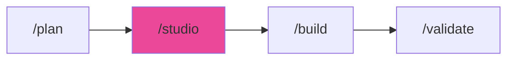

# /studio - Design Intelligence

$ARGUMENTS

---

## Purpose

Generate comprehensive design systems for web and mobile applications — 50+ styles, 97 color palettes, 57 font pairings, 99 UX guidelines, and chart recommendations across 10 technology stacks with AI-powered searchable database. **Differs from `/build` (implements full apps) and `/plan` (creates task breakdown) by focusing exclusively on design system generation and UI quality standards with anti-AI-slop intelligence.** Uses `frontend-specialist` with `studio` for design search and `design-system` for color theory and typography.

---

## 🤖 Meta-Agents Integration

| Phase | Agent | Action |
| ----- | ----- | ------ |
| **Style Selection** | `learner` | Analyze past successful design patterns |
| **Post-Design** | `learner` | Log design decisions for future reference |

```
Flow:
learner.analyze(past_designs) → recommendations
       ↓
search(product, style, color, typography) → design system
       ↓
verify(accessibility, contrast) → learner.log(patterns)
```

---

## 🔴 MANDATORY: Design System Protocol

### Phase 1: Requirements Analysis

| Field | Value |
|-------|-------|
| **INPUT** | $ARGUMENTS (UI/UX request with product type, style, industry) |
| **OUTPUT** | Extracted requirements: product type, style keywords, industry, stack |
| **AGENTS** | `frontend-specialist` |
| **SKILLS** | `studio`, `idea-storm` |

Extract from user request:

| Extract | Examples |
|---------|---------|
| Product type | SaaS, e-commerce, portfolio, dashboard, landing page |
| Style keywords | minimal, playful, professional, elegant, dark mode |
| Industry | healthcare, fintech, gaming, education, beauty |
| Stack | html-tailwind (default), react, nextjs, vue, svelte |

### Phase 2: Design System Generation

| Field | Value |
|-------|-------|
| **INPUT** | Requirements from Phase 1 |
| **OUTPUT** | Complete design system: pattern, style, colors, typography, effects |
| **AGENTS** | `frontend-specialist` |
| **SKILLS** | `studio`, `design-system` |

1. Generate design system (always start here):

```bash
node .agent/skills/studio/scripts-js/search.js "<product_type> <industry> <keywords>" --design-system -p "Project Name"
```

2. Optionally persist for hierarchical retrieval:

```bash
node .agent/skills/studio/scripts-js/search.js "<query>" --design-system --persist -p "Project Name"
```

Creates `design-system/MASTER.md` + optional `design-system/pages/<page>.md` overrides.

3. Supplement with domain searches as needed:

| Need | Domain | Command |
|------|--------|---------|
| More style options | `style` | `--domain style "glassmorphism dark"` |
| Chart types | `chart` | `--domain chart "real-time dashboard"` |
| UX guidelines | `ux` | `--domain ux "animation accessibility"` |
| Font alternatives | `typography` | `--domain typography "elegant luxury"` |
| Landing structure | `landing` | `--domain landing "hero social-proof"` |

Available domains: `product`, `style`, `typography`, `color`, `landing`, `chart`, `ux`, `react`, `web`, `prompt`

### Phase 3: Stack Guidelines & Implementation

| Field | Value |
|-------|-------|
| **INPUT** | Design system from Phase 2 |
| **OUTPUT** | Stack-specific implementation guidelines |
| **AGENTS** | `frontend-specialist` |
| **SKILLS** | `studio`, `frontend-design` |

```bash
node .agent/skills/studio/scripts-js/search.js "<keyword>" --stack html-tailwind
```

Available stacks: `html-tailwind`, `react`, `nextjs`, `vue`, `svelte`, `swiftui`, `react-native`, `flutter`, `shadcn`, `jetpack-compose`

### Phase 4: Pre-Delivery Verification

| Field | Value |
|-------|-------|
| **INPUT** | Implemented UI from Phase 3 |
| **OUTPUT** | Verified design: accessibility, contrast, responsiveness |
| **AGENTS** | `frontend-specialist` |
| **SKILLS** | `frontend-design`, `design-system` |

Pre-delivery checklist:

| Category | Checks |
|----------|--------|
| Visual | No emoji icons (use SVG), consistent icon set, correct brand logos |
| Interaction | `cursor-pointer` on clickable, hover feedback, smooth transitions (150-300ms) |
| Contrast | Light mode text ≥4.5:1, glass elements visible, borders in both modes |
| Layout | Floating navbar spacing, no hidden content, responsive (375-1440px) |
| Accessibility | Alt text, labeled inputs, color not sole indicator, `prefers-reduced-motion` |

---

## ⛔ MANDATORY: Problem Verification Before Completion

> **CRITICAL:** This check MUST be performed before any `notify_user` or task completion.

### Check @[current_problems]

```
1. Read @[current_problems] from IDE
2. If errors/warnings > 0:
   a. Auto-fix: imports, types, lint errors
   b. Re-check @[current_problems]
   c. If still > 0 → STOP → Notify user
3. If count = 0 → Proceed to completion
```

### Auto-Fixable

| Type | Fix |
|------|-----|
| Missing import | Add import statement |
| Unused variable | Remove or prefix `_` |
| Lint errors | Run eslint --fix |
| CSS issues | Fix class names, contrast |

> **Rule:** Never mark complete with errors in `@[current_problems]`.

---

## Output Format

```markdown
## 🎨 Design System: [Project Name]

### Configuration

| Setting | Value |
|---------|-------|
| Product | [type] |
| Style | [style name] |
| Stack | html-tailwind |

### Design Tokens

| Token | Value |
|-------|-------|
| Primary | [color] |
| Typography | [font pairing] |
| Effects | [style effects] |

### Quality Check

| Check | Status |
|-------|--------|
| Accessibility | ✅ WCAG AA |
| Responsive | ✅ 375-1440px |
| Dark mode | ✅ Contrast verified |

### Next Steps

- [ ] Review design system
- [ ] Run `/build` to implement
- [ ] Run `/validate` for accessibility audit
```

---

## Examples

```
/studio SaaS dashboard with dark mode
/studio e-commerce product page elegant
/studio healthcare portal accessible
/studio fintech crypto modern
/studio beauty spa wellness landing page
```

---

## Key Principles

- **Design system first** — always generate `--design-system` before implementation
- **Anti-AI-slop** — no emoji icons, no generic colors, no layout shifts on hover
- **Accessibility mandatory** — WCAG AA contrast, keyboard navigation, alt text
- **Persist for consistency** — use `--persist` for multi-page projects
- **SVG icons only** — use Heroicons/Lucide, never emoji as UI elements

---

## 🔗 Workflow Chain

**Skills Loaded (4):**

- `studio` - 50+ styles, 97 color palettes, 57 font pairings, searchable database
- `design-system` - Color theory, typography, visual effects
- `frontend-design` - Anti-AI-slop aesthetics and bold design
- `idea-storm` - Requirements clarification



| After /studio | Run | Purpose |
|--------------|-----|---------|
| Design ready | `/build` | Implement the design |
| Need review | `/inspect` | Code review |
| Ready to ship | `/launch` | Deploy |

**Handoff to /build:**

```markdown
🎨 Design system generated! Style: [style], Palette: [palette], Fonts: [fonts].
Run `/build` to implement the UI.
```
