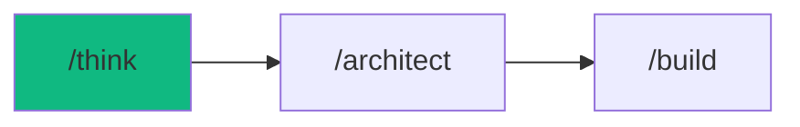

# /think - Strategic Decision Engine

$ARGUMENTS

---

## Purpose

Activate structured ideation mode for architecture decisions, feature planning, and problem-solving. **Unlike simple brainstorming, this produces actionable decision matrices.**

---

## 🤖 Meta-Agents Integration

| Phase | Agent | Action |
| ----- | ----- | ------ |
| **Decision Conflict** | `critic` | Arbitrate when options are too close |
| **Risk Assessment** | `assessor` | Evaluate risk of each option |
| **Pattern Learning** | `learner` | Learn from past decisions |

```
Flow:
generate options → assessor.evaluate(each)
       ↓
scores too close? → critic.arbitrate()
       ↓
decision made → learner.log(decision, context)
```

---

## 🔴 MANDATORY: Decision Framework

When `/think` is triggered:

### Phase 1: Problem Framing (2 min)
```
1. What OUTCOME do we want?
2. What CONSTRAINTS exist? (time, budget, tech)
3. Who are the STAKEHOLDERS?
4. What is the RISK TOLERANCE? (MVP/Production/Enterprise)
```

### Phase 2: Generate 3+ Options
**MINIMUM: 3 distinct approaches. Include one "unconventional" option.**

### Phase 3: Decision Matrix
Score each option 1-5:

| Criteria | Weight | Option A | Option B | Option C |
|----------|--------|----------|----------|----------|
| Implementation Speed | 20% | ? | ? | ? |
| Scalability | 25% | ? | ? | ? |
| Maintainability | 20% | ? | ? | ? |
| Team Expertise | 15% | ? | ? | ? |
| Cost | 20% | ? | ? | ? |
| **Weighted Score** | 100% | **?** | **?** | **?** |

### Phase 4: Risk Assessment
For the top option, identify:
- 🔴 **Blockers**: What could make this fail?
- 🟡 **Mitigations**: How do we reduce risk?
- 🟢 **Quick Wins**: What can we validate first?

---

## Output Format

```markdown
## 🧠 Decision: [Topic]

### Context
[1-2 sentence problem statement]

### Constraints
- ⏱️ Timeline: [deadline]
- 💰 Budget: [resources]
- 🛠️ Tech: [stack requirements]

---

### Option A: [Name] ⭐ RECOMMENDED
[Description]

| Pros | Cons |
|------|------|
| ✅ [benefit] | ❌ [drawback] |
| ✅ [benefit] | ❌ [drawback] |

📊 **Score:** 4.2/5 | ⏱️ **Effort:** Medium

---

### Option B: [Name]
[Description]

| Pros | Cons |
|------|------|
| ✅ [benefit] | ❌ [drawback] |

📊 **Score:** 3.5/5 | ⏱️ **Effort:** Low

---

### Option C: [Name] 🚀 UNCONVENTIONAL
[Description]

| Pros | Cons |
|------|------|
| ✅ [benefit] | ❌ [drawback] |

📊 **Score:** 3.0/5 | ⏱️ **Effort:** High

---

## 📊 Decision Matrix

| Criteria | Weight | A | B | C |
|----------|--------|---|---|---|
| Speed | 20% | 4 | 5 | 2 |
| Scalability | 25% | 5 | 3 | 5 |
| Maintainability | 20% | 4 | 4 | 3 |
| Team Fit | 15% | 4 | 5 | 2 |
| Cost | 20% | 3 | 4 | 2 |
| **Total** | | **4.1** | **4.0** | **2.9** |

---

## 🎯 Recommendation

**Option A** wins with score 4.1/5.

### Risk Assessment
- 🔴 **Blocker**: [potential issue]
- 🟡 **Mitigation**: [how to address]
- 🟢 **Validate First**: [quick experiment]

### Next Steps
1. [ ] [First action]
2. [ ] [Second action]
3. [ ] [Third action]

Proceed with Option A? (y/n)
```

---

## Examples

```
/think authentication: JWT vs Session vs OAuth
/think state management: Redux vs Zustand vs Context
/think database: PostgreSQL vs MongoDB vs Supabase
/think hosting: Vercel vs AWS vs Railway
/think monorepo vs polyrepo for microservices
```

---

## Key Principles

- **Quantify decisions** - use scoring, not just vibes
- **Include unconventional** - the wild option often sparks insights
- **Risk-first thinking** - identify blockers before committing
- **Actionable output** - end with clear next steps
- **No code** - this is strategy, not implementation

---

## 🔗 Workflow Chain



| After /think | Run | Purpose |
|--------------|-----|---------|
| Decision made | `/architect` | Create detailed implementation plan |
| Need more research | `/think` again | Explore deeper |
| Complex task | `/autopilot` | Let AI coordinate everything |

**Handoff to /architect:**
```markdown
User approved Option A. Run /architect to create implementation plan.
```
