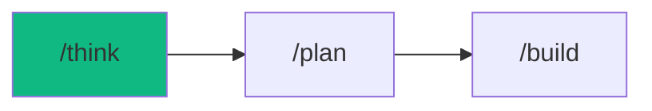

# /think - Strategic Decision Engine

$ARGUMENTS

---

## Purpose

Activate structured ideation mode for architecture decisions, feature planning, and problem-solving — generating 3+ distinct options with weighted scoring matrices and risk assessments. **Differs from `/plan` (creates task breakdown and PLAN.md) and `/build` (writes code) by producing actionable decision matrices only — NO CODE, NO PLANS.** Uses `project-planner` with `idea-storm` for Socratic questioning and `system-design` for trade-off evaluation.

---

## 🤖 Meta-Agents Integration

| Phase | Agent | Action |
| ----- | ----- | ------ |
| **Pre-Flight** | `assessor` | Evaluate decision scope and knowledge-compiler context |
| **Execution** | `orchestrator` / `critic` | Coordinate problem framing, option generation and resolve scoring conflicts |
| **Safety** | `recovery` | Save state and recover from decision generation failures |
| **Post-Think** | `learner` | Log decision outcomes and scoring intelligence |

```
Flow:
generate options �’ score(decision_matrix)
       ↓
scores too close? �’ critic.arbitrate()
       ↓
decision made �’ recommendation + next steps
```

---

## 🔴 MANDATORY: Decision Framework

### Phase 0: Pre-flight & Auto-Learned Context

> **Rule 0.5-K:** Auto-learned pattern check.

1. Read `.agent/skills/auto-learned/patterns/` for past failures before proceeding.
2. Trigger `recovery` agent to run Checkpoint (`git commit -m "chore(checkpoint): pre-think"`).

### Phase 1: Pre-flight & knowledge-compiler Context

> **Rule 0.5-K:** knowledge-compiler pattern check.

1. Read `.agent/skills/knowledge-compiler/patterns/` for past failures before proceeding.
2. Trigger `recovery` agent to run Checkpoint (`git commit -m "chore(checkpoint): pre-think"`).

### Phase 2: Problem Framing

| Field | Value |
|-------|-------|
| **INPUT** | $ARGUMENTS (decision topic or problem statement) |
| **OUTPUT** | Framed problem: outcome, constraints, stakeholders, risk tolerance |
| **AGENTS** | `project-planner`, `assessor` |
| **SKILLS** | `idea-storm`, `context-engineering` |

// turbo — telemetry: phase-2-framing

Ask if not provided:

| Question | Purpose |
|----------|---------|
| What OUTCOME do we want? | Define success criteria |
| What CONSTRAINTS exist? | Time, budget, tech limitations |
| Who are the STAKEHOLDERS? | Users, team, business |
| What is the RISK TOLERANCE? | MVP / Production / Enterprise |

### Phase 3: Generate 3+ Options

| Field | Value |
|-------|-------|
| **INPUT** | Problem frame from Phase 2 |
| **OUTPUT** | 3+ distinct approaches with pros/cons |
| **AGENTS** | `project-planner`, `orchestrator` |
| **SKILLS** | `idea-storm`, `system-design` |

// turbo — telemetry: phase-3-options

**Minimum 3 distinct approaches. Include one "unconventional" option.**

For each option:
- Description and approach
- Pros / Cons table
- Effort estimate (Low / Medium / High)

### Phase 4: Decision Matrix & Recommendation

| Field | Value |
|-------|-------|
| **INPUT** | Options from Phase 3 |
| **OUTPUT** | Scored decision matrix, recommended option, risk assessment |
| **AGENTS** | `project-planner`, `critic`, `learner` |
| **SKILLS** | `system-design`, `problem-checker`, `knowledge-compiler` |

// turbo — telemetry: phase-4-decision

Score each option 1-5:

| Criteria | Weight | Option A | Option B | Option C |
|----------|--------|----------|----------|----------|
| Implementation Speed | 20% | ? | ? | ? |
| Scalability | 25% | ? | ? | ? |
| Maintainability | 20% | ? | ? | ? |
| Team Expertise | 15% | ? | ? | ? |
| Cost | 20% | ? | ? | ? |
| **Weighted Score** | 100% | **?** | **?** | **?** |

If scores too close �’ `critic` arbitrates.

Risk assessment for top option:
- 🔴 **Blockers** — what could make this fail?
- 🟡 **Mitigations** — how to reduce risk?
- 🟢 **Quick Wins** — what to validate first?

---

## ⛔ MANDATORY: Problem Verification Before Completion

> **CRITICAL:** This check MUST be performed before any `notify_user` or task completion.

### Check @[current_problems]

```
1. Read @[current_problems] from IDE
2. If errors/warnings > 0:
   a. Auto-fix: imports, types, lint errors
   b. Re-check @[current_problems]
   c. If still > 0 �’ STOP �’ Notify user
3. If count = 0 �’ Proceed to completion
```

> **Note:** /think produces decisions, not code. This check applies only if any artifacts were generated.

---

## 🔙 Rollback & Recovery

If the generated decision matrix is flawed, overly generic, or hallucinates constraints:
1. Revert any generated markdown files using the `recovery` meta-agent.
2. Feed the failed reasoning back to the `critic` agent to identify logic gaps.
3. Retry Phase 3 with more explicit constraints or a completely different Socratic framing.

---

## Output Format

```markdown
## 🧠 Decision: [Topic]

### Context
[1-2 sentence problem statement]

### Constraints
- ⏱️ Timeline: [deadline]
- �’� Budget: [resources]
- 🛠️ Tech: [stack requirements]

### Option A: [Name] ⭐ RECOMMENDED
[Description]

| Pros | Cons |
|------|------|
| ✅ [benefit] | ❌ [drawback] |

📊 Score: 4.2/5 | ⏱️ Effort: Medium

### Option B: [Name]
[Description]

📊 Score: 3.5/5 | ⏱️ Effort: Low

### Option C: [Name] 🚀 UNCONVENTIONAL
[Description]

📊 Score: 3.0/5 | ⏱️ Effort: High

### Decision Matrix

| Criteria | Weight | A | B | C |
|----------|--------|---|---|---|
| Speed | 20% | 4 | 5 | 2 |
| Scalability | 25% | 5 | 3 | 5 |
| Maintainability | 20% | 4 | 4 | 3 |
| Team Fit | 15% | 4 | 5 | 2 |
| Cost | 20% | 3 | 4 | 2 |
| **Total** | | **4.1** | **4.0** | **2.9** |

### Recommendation

**Option A** wins with score 4.1/5.
- 🔴 Blocker: [potential issue]
- 🟡 Mitigation: [how to address]
- 🟢 Validate First: [quick experiment]

### Next Steps

- [ ] Approve Option A
- [ ] Run `/plan` to create implementation plan
- [ ] Or `/think` again for deeper analysis
```

---

## Examples

```
/think authentication: JWT vs Session vs OAuth
/think state management: Redux vs Zustand vs Context
/think database: PostgreSQL vs MongoDB vs Supabase
/think hosting: Vercel vs AWS vs Railway
/think monorepo vs polyrepo for microservices
```

---

## Key Principles

- **Quantify decisions** — use weighted scoring, not just vibes
- **Include unconventional** — the wild option often sparks insights
- **Risk-first thinking** — identify blockers before committing
- **Actionable output** — end with clear next steps, not abstract analysis
- **No code** — this is strategy, not implementation

---

## �— Workflow Chain

**Skills Loaded (6):**

- `idea-storm` - Socratic questioning and brainstorming
- `system-design` - Trade-off evaluation and ADR
- `project-planner` - Task breakdown and feasibility
- `context-engineering` - Codebase parsing and context extraction
- `problem-checker` - Generated artifacts validation
- `knowledge-compiler` - Learning and logging decision patterns



| After /think | Run | Purpose |
|-------------|-----|---------|
| Decision made | `/plan` | Create detailed implementation plan |
| Need more research | `/think` | Explore deeper with different framing |
| Complex task | `/autopilot` | Full autonomous coordination |

**Handoff to /plan:**

```markdown
🧠 Decision: Option [X] approved — [name] ([score]/5).
Run `/plan` to create implementation plan.
```
