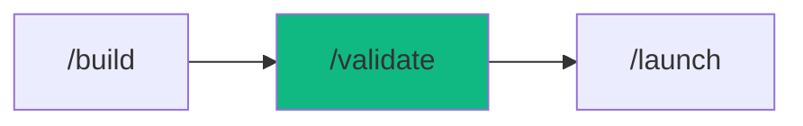

# /validate - Test Automation Suite

$ARGUMENTS

---

## Purpose

Generate comprehensive tests, execute suites, and analyze coverage — supporting unit tests (Vitest/Jest), E2E (Playwright), mutation testing (Stryker), visual regression, and API contract testing. **Differs from `/inspect` (code review without execution) and `/optimize` (performance profiling) by actively generating, running, and verifying test suites with the AAA pattern.** Uses `test-architect` with `test-architect` for test generation and `e2e-automation` for browser testing.

---

## ?? Meta-Agents Integration

| Phase | Agent | Action |
| ----- | ----- | ------ |
| **Pre-Flight** | `assessor` | Evaluate test targets and knowledge-compiler context |
| **Execution** | `orchestrator` | Coordinate test generation, execution, and analysis |
| **Safety** | `recovery` | Save state and recover from test execution failures |
| **Post-Validate**| `learner` | Log test execution telemetry and failure patterns |

```
Flow:
recovery.save(state) ? generate(tests) ? execute(suite)
       ?
analyze(coverage, mutations, visual, contracts)
       ?
learner.log(failure_patterns)
```

---

## Sub-Commands

| Command | Action |
|---------|--------|
| `/validate` | Run all tests |
| `/validate [target]` | Generate tests for specific file/feature |
| `/validate coverage` | Show coverage report |
| `/validate watch` | Run in watch mode |
| `/validate fix` | Auto-fix failing tests |
| `/validate mutation` | Run mutation testing |
| `/validate visual` | Run visual regression tests |
| `/validate contract` | Run API contract tests |

---

## ?? MANDATORY: Test Automation Protocol

### Phase 1: Pre-flight & knowledge-compiler Context

> **Rule 0.5-K:** knowledge-compiler pattern check.

1. Read `.agent/skills/knowledge-compiler/patterns/` for past failures before proceeding.
2. Trigger `recovery` agent to run Checkpoint (`git commit -m "chore(checkpoint): pre-validate"`).

### Phase 2: Test Generation

| Field | Value |
|-------|-------|
| **INPUT** | $ARGUMENTS (target file/feature or "all") |
| **OUTPUT** | Test files following AAA pattern |
| **AGENTS** | `test-architect`, `assessor` |
| **SKILLS** | `test-architect`, `context-engineering` |

// turbo — telemetry: phase-2-generate

1. Detect test framework:

| Project | Framework | Config |
|---------|-----------|--------|
| Next.js | Vitest | vitest.config.ts |
| Node.js | Jest | jest.config.js |
| React | Vitest + RTL | vitest.config.ts |
| API | Supertest | jest.config.js |
| Python | Pytest | pytest.ini |

2. Analyze target and identify test cases:

| Category | Example |
|----------|---------|
| Happy Path | Valid input ? expected output |
| Empty Input | `""`, `[]`, `null`, `undefined` |
| Boundary | Min, max, off-by-one |
| Type Errors | Wrong type, missing property |
| Async | Timeout, race condition, retry |
| Security | XSS, injection, auth bypass |

3. Generate tests using AAA pattern (Arrange, Act, Assert)

### Phase 3: Test Execution

| Field | Value |
|-------|-------|
| **INPUT** | Test files from Phase 2 |
| **OUTPUT** | Test results: pass/fail counts, coverage report |
| **AGENTS** | `test-architect`, `orchestrator` |
| **SKILLS** | `test-architect`, `e2e-automation` |

// turbo — telemetry: phase-3-execute

// turbo
```bash
npx cross-env OTEL_SERVICE_NAME="workflow:validate" TRACE_ID="$TRACE_ID" npm test -- --coverage
```

Coverage targets:

| Metric | Target | Critical |
|--------|--------|----------|
| Statements | =80% | =60% |
| Branches | =70% | =50% |
| Mutation Score | =80% | =60% |

### Phase 4: Advanced Testing

| Field | Value |
|-------|-------|
| **INPUT** | Coverage report from Phase 3 |
| **OUTPUT** | Mutation score, visual diffs, contract results |
| **AGENTS** | `test-architect`, `orchestrator` |
| **SKILLS** | `test-architect`, `e2e-automation` |

// turbo — telemetry: phase-4-advanced

Mutation testing (if requested):
// turbo
```bash
npx cross-env OTEL_SERVICE_NAME="workflow:validate" TRACE_ID="$TRACE_ID" npx stryker run
```

Visual regression (if requested):
// turbo
```bash
npx cross-env OTEL_SERVICE_NAME="workflow:validate" TRACE_ID="$TRACE_ID" npx playwright test --project=visual
```

Contract testing (if requested):
// turbo
```bash
npx cross-env OTEL_SERVICE_NAME="workflow:validate" TRACE_ID="$TRACE_ID" npx pact-verifier
```

### Phase 5: Results Analysis

| Field | Value |
|-------|-------|
| **INPUT** | All test results from Phases 3-4 |
| **OUTPUT** | Test report with pass/fail, coverage, recommendations |
| **AGENTS** | `test-architect`, `learner` |
| **SKILLS** | `test-architect`, `problem-checker`, `knowledge-compiler` |

// turbo — telemetry: phase-5-analyze

1. Aggregate results across all test types
2. Compare against coverage targets
3. Generate actionable recommendations for failures

---

## ? MANDATORY: Problem Verification Before Completion

> **CRITICAL:** This check MUST be performed before any `notify_user` or task completion.

### Check @[current_problems]

```
1. Read @[current_problems] from IDE
2. If errors/warnings > 0:
   a. Auto-fix: imports, types, lint errors
   b. Re-check @[current_problems]
   c. If still > 0 ? STOP ? Notify user
3. If count = 0 ? Proceed to completion
```

### Auto-Fixable

| Type | Fix |
|------|-----|
| Missing import | Add import statement |
| Unused variable | Remove or prefix `_` |
| Type mismatch | Fix type annotation |
| Lint errors | Run eslint --fix |

> **Rule:** Never mark complete with errors in `@[current_problems]`.

---

## ?? Rollback & Recovery

If tests hang or mutate files in unexpected ways:
1. Trigger `recovery` meta-agent to run `git restore .` to revert mutated source files.
2. Force kill hanging playwright browsers and Node.js testing processes.
3. Review `learner` logs to identify flaky logic and update test assertions before re-running.

---

## Output Format

```markdown
## ?? Test Results

### Summary
? Passed: 42  ? Failed: 2  ?? Skipped: 1

### Coverage

| Metric | Current | Target | Status |
|--------|---------|--------|--------|
| Statements | 85% | 80% | ? |
| Branches | 72% | 70% | ? |
| Mutation Score | 82% | 80% | ? |
| Visual Diffs | 0 | 0 | ? |
| Contracts | 5/5 | 100% | ? |

### Failures

| Test | Error | Fix |
|------|-------|-----|
| user.test.ts:45 | Timeout | Increase wait |
| cart.test.ts:12 | Assert | Update expected |

### Next Steps

- [ ] Fix 2 failing tests
- [ ] Review visual baseline
- [ ] Run `/launch` when all green
```

---

## Examples

```
/validate
/validate src/services/user.service.ts
/validate coverage
/validate mutation
/validate visual
```

---

## Key Principles

- **Test behavior, not implementation** — assert on outcomes, not internals
- **AAA pattern** — Arrange, Act, Assert for every test
- **One assertion per test** — focused, readable tests
- **Mock external deps** — isolate the unit under test
- **Mutation testing** — verify test quality, not just coverage

---

## ?? Workflow Chain

**Skills Loaded (6):**

- `test-architect` - Test patterns, AAA, coverage strategy
- `e2e-automation` - Playwright, visual testing, browser automation
- `code-review` - Quality validation of test code
- `context-engineering` - Codebase parsing and framework detection
- `problem-checker` - Code problem verification
- `knowledge-compiler` - Learning and logging test patterns



| After /validate | Run | Purpose |
|----------------|-----|---------|
| All tests pass | `/launch` | Deploy to production |
| Tests fail | `/diagnose` | Root cause analysis |
| Need review | `/inspect` | Code review |

**Handoff to /launch:**

```markdown
?? Tests complete! Passed: [X], Failed: [Y]. Coverage: [Z]%.
Run `/launch` to deploy or `/diagnose` for failures.
```
