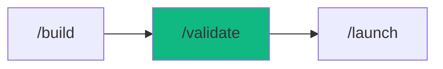

# /validate - Test Automation Suite

$ARGUMENTS

---

## Purpose

Generate comprehensive tests, execute test suites, and analyze coverage. **Follows AAA pattern (Arrange-Act-Assert) with edge case detection.**

---

## 🤖 Meta-Agents Integration

| Phase | Agent | Action |
| ----- | ----- | ------ |
| **Test Generation** | `learner` | Analyze existing test patterns for consistency |
| **Pre-Test** | `recovery` | Save test state before execution |
| **Post-Test** | `learner` | Log common failure patterns |
| **On Failure** | `assessor` | Evaluate test failure severity |

```
Flow:
learner.analyze(existing_tests) → generate tests
       ↓
recovery.save() → run tests
       ↓
failures? → assessor.evaluate(severity) → learner.log(patterns)
```

---

## Sub-commands

```
/validate              - Run all tests
/validate [target]     - Generate tests for specific file/feature
/validate coverage     - Show coverage report
/validate watch        - Run in watch mode
/validate fix          - Auto-fix failing tests
```

---

## 🔴 MANDATORY: Test Generation Protocol

### Step 1: Analyze Target
```
For function/component, identify:
□ Happy path (normal use)
□ Edge cases (boundaries, empty, null)
□ Error cases (invalid input, exceptions)
□ Integration points (external deps)
```

### Step 2: Generate Test Cases

| Category | Example |
|----------|---------|
| **Happy Path** | Valid input → expected output |
| **Empty Input** | `""`, `[]`, `null`, `undefined` |
| **Boundary** | Min value, max value, off-by-one |
| **Type Errors** | Wrong type, missing property |
| **Async** | Timeout, race condition, retry |
| **Security** | XSS, injection, auth bypass |

### Step 3: Apply AAA Pattern

```typescript
describe('UserService', () => {
  describe('createUser', () => {
    it('should create user with valid data', async () => {
      // ARRANGE
      const input = {
        email: 'test@example.com',
        name: 'Test User',
      };
      
      // ACT
      const result = await userService.createUser(input);
      
      // ASSERT
      expect(result.id).toBeDefined();
      expect(result.email).toBe(input.email);
    });

    it('should throw for invalid email', async () => {
      // ARRANGE
      const input = { email: 'invalid', name: 'Test' };
      
      // ACT & ASSERT
      await expect(userService.createUser(input))
        .rejects.toThrow('Invalid email');
    });
  });
});
```

---

## Output Format

### Test Generation

```markdown
## 🧪 Tests: [Target]

### Analysis
| Aspect | Value |
|--------|-------|
| Functions | 5 |
| Complexity | Medium |
| Dependencies | 2 (mock required) |

### Test Plan

| Test Case | Type | Priority |
|-----------|------|----------|
| Create with valid data | Happy | High |
| Create with empty name | Edge | Medium |
| Create with duplicate email | Error | High |
| Update non-existent user | Error | Medium |
| Delete with cascade | Integration | High |

### Generated Tests

📁 `tests/services/user.test.ts`

[Generated test code]

---

Run: `npm test`
Coverage: `npm run coverage`
```

### Test Execution

```markdown
## 🧪 Test Results

### Summary
✅ Passed: 42
❌ Failed: 2
⏭️ Skipped: 1

### Failed Tests

**1. UserService.createUser**
```
Expected: user object
Received: null

File: tests/services/user.test.ts:42
```

**2. AuthService.login**
```
Timeout: 5000ms exceeded

File: tests/services/auth.test.ts:28
```

### Coverage

| Metric | Current | Target | Status |
|--------|---------|--------|--------|
| Statements | 78% | 80% | ⚠️ |
| Branches | 65% | 70% | ⚠️ |
| Functions | 85% | 80% | ✅ |
| Lines | 79% | 80% | ⚠️ |

### Uncovered Lines

| File | Lines |
|------|-------|
| `src/services/user.ts` | 45-52, 78-80 |
| `src/utils/validate.ts` | 23-25 |

### Next Steps
1. Fix 2 failing tests
2. Add tests for uncovered lines
3. Run `/validate` again
```

---

## Examples

```
/validate
/validate src/services/auth.ts
/validate user registration flow
/validate coverage
/validate watch
/validate fix failing tests
```

---

## Test Framework Detection

| Project Type | Framework | Config |
|--------------|-----------|--------|
| Next.js | Vitest | vitest.config.ts |
| Node.js | Jest | jest.config.js |
| React | Vitest/RTL | vitest.config.ts |
| API | Supertest | jest.config.js |

---

## Key Principles

1. **Test behavior, not implementation** - focus on outcomes
2. **One assertion per test** - easier to debug
3. **Descriptive names** - test name = documentation
4. **Mock external deps** - isolate unit under test
5. **AAA pattern** - consistent structure
6. **Edge cases first** - catch bugs before happy path

---

## 🔗 Workflow Chain



| After /validate | Run | Purpose |
|-----------------|-----|---------|
| All tests pass | `/launch` | Deploy to production |
| Tests fail | `/diagnose` | Find root cause |
| Need review | `/inspect` | Code review |

**Handoff to /launch:**
```markdown
Tests: 42/42 passed. Coverage: 85%.
Run /launch to deploy to production.
```
