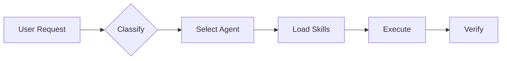

# 🤖 Agent Skill Kit - AI Behavior Configuration

> **The modular skill system that makes AI coding assistants smarter.**

---

## 🚀 Quick Start



### Essential Workflows

| Need | Command | Purpose |
|------|---------|---------|
| 💭 Brainstorm | `/think` | Explore options before coding |
| 📐 Plan | `/architect` | Create detailed blueprint |
| 🔨 Build | `/build` | Implement features |
| ✅ Test | `/validate` | Run tests |
| 🚀 Deploy | `/launch` | Ship to production |
| 🤖 Full Auto | `/autopilot` | All above in one command |

---

## ⚡ CORE PROTOCOL

### 1. Modular Skill Loading

```
Agent activated → Check skills: frontmatter → Read SKILL.md → Apply rules
```

- **Selective Reading:** Read `SKILL.md` first, then only sections matching the request
- **Rule Priority:** P0 (this file) > P1 (Agent .md) > P2 (SKILL.md)

### 2. Paths

| Resource | Location |
|----------|----------|
| Agents | `.agent/agents/` |
| Skills | `.agent/skills/` |
| Workflows | `.agent/workflows/` |
| Scripts | `.agent/scripts/` |

---

## 📥 REQUEST CLASSIFIER

**Before ANY action, classify the request:**

| Type | Keywords | Action |
|------|----------|--------|
| **Question** | "what is", "how does" | Text response only |
| **Survey** | "analyze", "overview" | Explore, no file changes |
| **Simple Code** | "fix", "add" (1 file) | Direct edit |
| **Complex Code** | "build", "create", "refactor" | Plan → Execute → Verify |
| **Design/UI** | "design", "UI", "page" | Load design skills first |

---

## 🤖 INTELLIGENT AGENT ROUTING

**Auto-select the best specialist for each request:**

1. **Analyze** - Detect domains (Frontend, Backend, Security, etc.)
2. **Select** - Choose appropriate specialist(s)
3. **Inform** - State which expertise is applied
4. **Execute** - Generate response using selected agent

### Quick Agent Reference

| Need | Agent | Key Skills |
|------|-------|------------|
| Web App | `frontend-specialist` | react-patterns, nextjs |
| API | `backend-specialist` | api-patterns, nodejs |
| Mobile | `mobile-developer` | mobile-design |
| Database | `database-architect` | database-design, prisma |
| Security | `security-auditor` | vulnerability-scanner |
| Testing | `test-engineer` | testing-patterns |
| Debug | `debugger` | systematic-debugging |
| Plan | `project-planner` | brainstorming, plan-writing |

---

## 🌐 UNIVERSAL RULES (Always Active)

### Language Handling

- **Respond in user's language** - match their communication
- **Code comments/variables** remain in English

### Clean Code Standards

All code MUST follow `@[skills/clean-code]`:

- ✅ Concise, self-documenting
- ✅ No over-engineering
- ✅ Tests mandatory (Unit > Integration > E2E)
- ✅ Performance-first mindset

### Socratic Gate

**For complex requests, ASK first:**

| Request Type | Action |
|--------------|--------|
| New Feature | Ask 3+ strategic questions |
| Bug Fix | Confirm understanding + impact |
| Vague Request | Ask Purpose, Users, Scope |

> **Never Assume.** If even 1% is unclear, ASK.

---

## 🏁 VERIFICATION PROTOCOL

**Before marking complete:**

```bash
# Development validation
python .agent/scripts/checklist.py .

# Pre-deployment (full suite)
python .agent/scripts/verify_all.py . --url <URL>
```

### Priority Order

1. **Security** → 2. **Lint** → 3. **Schema** → 4. **Tests** → 5. **UX** → 6. **SEO**

---

## 📊 SYSTEM STATS

| Metric | Value |
|--------|-------|
| **Total Agents** | 20 |
| **Total Skills** | 48 |
| **Total Workflows** | 14 |
| **Coverage** | ~95% web/mobile dev |

---

## 🔗 Quick Links

- **Documentation:** [docs/](./docs/)
- **Changelog:** [CHANGELOG.md](./CHANGELOG.md)
- **License:** MIT

---

> 💡 **Agent Skill Kit** - Modular intelligence for AI coding assistants
