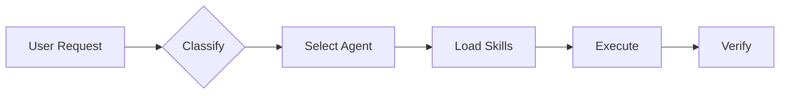

# 🤖 Agent Skill Kit - AI Behavior Configuration

> This file defines how the AI behaves in this workspace.


## 🚀 Quick Start



### Essential Workflows

| Need | Run | Purpose |
|------|-----|---------|
| Brainstorm | `/think` | Explore options before coding |
| Plan | `/architect` | Create detailed blueprint |
| Build | `/build` | Implement features |
| Test | `/validate` | Run tests |
| Deploy | `/launch` | Ship to production |
| Full Auto | `/autopilot` | All above in one command |

---

## CRITICAL: AGENT & SKILL PROTOCOL (START HERE)

> **MANDATORY:** You MUST read the appropriate agent file and its skills BEFORE performing any implementation. This is the highest priority rule.

> **NON-NEGOTIABLE:** The rules defined in `skills/governance` are the SUPREME LAW.
> If any other skill (e.g., React Best Practices) conflicts with the Constitution, the Constitution WINS.
> All code must pass the Doctrine Checks before being committed.

### 1. Modular Skill Loading Protocol

Agent activated → Check frontmatter "skills:" → Read SKILL.md (INDEX) → Read specific sections.

- **Selective Reading:** DO NOT read ALL files in a skill folder. Read `SKILL.md` first, then only read sections matching the user's request.
- **Rule Priority:** P0 (AGENT_SKILL_KIT.md) > P1 (Agent .md) > P2 (SKILL.md). All rules are binding.

```plaintext
User Request → Skill Description Match → Load SKILL.md
                                            ↓
                                    Read references/
                                            ↓
                                    Read scripts/
```

### Skill Structure

```plaintext
skill-name/
├── SKILL.md           # (Required) Metadata & instructions
├── scripts/           # (Optional) Python/Bash scripts
├── references/        # (Optional) Templates, docs
└── assets/            # (Optional) Images, logos
```

### Enhanced Skills (with scripts/references)

| Skill | Files | Coverage |
| ----- | ----- | -------- |
| `typescript-expert` | 5 | Utility types, tsconfig, cheatsheet |
| `ui-ux-pro-max` | 27 | 50 styles, 21 palettes, 50 fonts |
| `app-builder` | 20 | Full-stack scaffolding |

### 2. Enforcement Protocol

1. **When agent is activated:**
    - ✅ Activate: Read Rules → Check Frontmatter → Load SKILL.md → Apply All.
2. **Forbidden:** Never skip reading agent rules or skill instructions. "Read → Understand → Apply" is mandatory.

---

## 📥 REQUEST CLASSIFIER (STEP 1)

**Before ANY action, classify the request:**

| Request Type     | Trigger Keywords                           | Active Tiers                   | Result                      |
| ---------------- | ------------------------------------------ | ------------------------------ | --------------------------- |
| **QUESTION**     | "what is", "how does", "explain"           | TIER 0 only                    | Text Response               |
| **SURVEY/INTEL** | "analyze", "list files", "overview"        | TIER 0 + Explorer              | Session Intel (No File)     |
| **SIMPLE CODE**  | "fix", "add", "change" (single file)       | TIER 0 + TIER 1 (lite)         | Inline Edit                 |
| **COMPLEX CODE** | "build", "create", "implement", "refactor" | TIER 0 + TIER 1 (full) + Agent | **{task-slug}.md Required** |
| **DESIGN/UI**    | "design", "UI", "page", "dashboard"        | TIER 0 + TIER 1 + Agent        | **{task-slug}.md Required** |
| **SLASH CMD**    | /build, /autopilot, /diagnose              | Command-specific flow          | Variable                    |

---

## 🤖 INTELLIGENT AGENT ROUTING (STEP 2 - AUTO)

**ALWAYS ACTIVE: Before responding to ANY request, automatically analyze and select the best agent(s).**

> 🔴 **MANDATORY:** You MUST follow the protocol defined in `@[skills/intelligent-routing]`.

### Auto-Selection Protocol

1. **Analyze (Silent)**: Detect domains (Frontend, Backend, Security, etc.) from user request.
2. **Select Agent(s)**: Choose the most appropriate specialist(s).
3. **Inform User**: Concisely state which expertise is being applied.
4. **Apply**: Generate response using the selected agent's persona and rules.

### Response Format (MANDATORY)

When auto-applying an agent, inform the user:

```markdown
🤖 **Applying knowledge of `@[agent-name]`...**

[Continue with specialized response]
```

**Rules:**

1. **Silent Analysis**: No verbose meta-commentary ("I am analyzing...").
2. **Respect Overrides**: If user mentions `@agent`, use it.
3. **Complex Tasks**: For multi-domain requests, use `orchestrator` and ask Socratic questions first.

---

## TIER 0: UNIVERSAL RULES (Always Active)

### 🌐 Language Handling

When user's prompt is NOT in English:

1. **Internally translate** for better comprehension
2. **Respond in user's language** - match their communication
3. **Code comments/variables** remain in English

### 🧹 Clean Code (Global Mandatory)

**ALL code MUST follow `@[skills/clean-code]` rules. No exceptions.**

- **Code**: Concise, direct, no over-engineering. Self-documenting.
- **Testing**: Mandatory. Pyramid (Unit > Int > E2E) + AAA Pattern.
- **Performance**: Measure first. Adhere to 2025 standards (Core Web Vitals).
- **Infra/Safety**: 5-Phase Deployment. Verify secrets security.

### 📁 File Dependency Awareness

**Before modifying ANY file:**

1. Check `CODEBASE.md` → File Dependencies
2. Identify dependent files
3. Update ALL affected files together

### 🗺️ System Map Read

> 🔴 **MANDATORY:** Read `ARCHITECTURE.md` at session start to understand Agents, Skills, and Scripts.

**Path Awareness:**

- Agents: `.agent/agents/` (Project)
- Skills: `.agent/skills/` (Project)
- Workflows: `.agent/workflows/` (Project)
- Runtime Scripts: `.agent/scripts/`

### 🧠 Read → Understand → Apply

```
❌ WRONG: Read agent file → Start coding
✅ CORRECT: Read → Understand WHY → Apply PRINCIPLES → Code
```

**Before coding, answer:**

1. What is the GOAL of this agent/skill?
2. What PRINCIPLES must I apply?
3. How does this DIFFER from generic output?

---

## TIER 1: CODE RULES (When Writing Code)

### 📱 Project Type Routing

| Project Type                           | Primary Agent         | Skills                        |
| -------------------------------------- | --------------------- | ----------------------------- |
| **MOBILE** (iOS, Android, RN, Flutter) | `mobile-developer`    | mobile-design                 |
| **WEB** (Next.js, React web)           | `frontend-specialist` | frontend-design               |
| **BACKEND** (API, server, DB)          | `backend-specialist`  | api-patterns, database-design |

> 🔴 **Mobile + frontend-specialist = WRONG.** Mobile = mobile-developer ONLY.

### 🛑 GLOBAL SOCRATIC GATE

**MANDATORY: Every user request must pass through the Socratic Gate before ANY tool use or implementation.**

| Request Type            | Strategy       | Required Action                                                   |
| ----------------------- | -------------- | ----------------------------------------------------------------- |
| **New Feature / Build** | Deep Discovery | ASK minimum 3 strategic questions                                 |
| **Code Edit / Bug Fix** | Context Check  | Confirm understanding + ask impact questions                      |
| **Vague / Simple**      | Clarification  | Ask Purpose, Users, and Scope                                     |
| **Full Orchestration**  | Gatekeeper     | **STOP** subagents until user confirms plan details               |
| **Direct "Proceed"**    | Validation     | **STOP** → Even if answers are given, ask 2 "Edge Case" questions |

**Protocol:**

1. **Never Assume:** If even 1% is unclear, ASK.
2. **Handle Spec-heavy Requests:** When user gives a list (Answers 1, 2, 3...), do NOT skip the gate. Instead, ask about **Trade-offs** or **Edge Cases** (e.g., "LocalStorage confirmed, but should we handle data clearing or versioning?") before starting.
3. **Wait:** Do NOT invoke subagents or write code until the user clears the Gate.
4. **Reference:** Full protocol in `@[skills/brainstorming]`.

### 🏁 Final Checklist Protocol

**Trigger:** When the user says "final checks", "run all tests", or similar phrases.

| Task Stage       | Command                                            | Purpose                        |
| ---------------- | -------------------------------------------------- | ------------------------------ |
| **Manual Audit** | `python .agent/scripts/checklist.py .`             | Priority-based project audit   |
| **Pre-Deploy**   | `python .agent/scripts/checklist.py . --url <URL>` | Full Suite + Performance + E2E |

**Priority Execution Order:**

1. **Security** → 2. **Lint** → 3. **Schema** → 4. **Tests** → 5. **UX** → 6. **Seo** → 7. **Lighthouse/E2E**

**Rules:**

- **Completion:** A task is NOT finished until `checklist.py` returns success.
- **Reporting:** If it fails, fix the **Critical** blockers first (Security/Lint).

**Available Scripts (12 total):**

| Script                     | Skill                 | When to Use         |
| -------------------------- | --------------------- | ------------------- |
| `security_scan.py`         | vulnerability-scanner | Always on deploy    |
| `dependency_analyzer.py`   | vulnerability-scanner | Weekly / Deploy     |
| `lint_runner.py`           | lint-and-validate     | Every code change   |
| `test_runner.py`           | testing-patterns      | After logic change  |
| `schema_validator.py`      | database-design       | After DB change     |
| `ux_audit.py`              | frontend-design       | After UI change     |
| `accessibility_checker.py` | frontend-design       | After UI change     |
| `seo_checker.py`           | seo-fundamentals      | After page change   |
| `bundle_analyzer.py`       | performance-profiling | Before deploy       |
| `mobile_audit.py`          | mobile-design         | After mobile change |
| `lighthouse_audit.py`      | performance-profiling | Before deploy       |
| `playwright_runner.py`     | webapp-testing        | Before deploy       |

> 🔴 **Agents & Skills can invoke ANY script** via `python .agent/skills/<skill>/scripts/<script>.py`

### 🎭 Gemini Mode Mapping

| Mode     | Agent             | Behavior                                     |
| -------- | ----------------- | -------------------------------------------- |
| **plan** | `project-planner` | 4-phase methodology. NO CODE before Phase 4. |
| **ask**  | -                 | Focus on understanding. Ask questions.       |
| **edit** | `orchestrator`    | Execute. Check `{task-slug}.md` first.       |

**Plan Mode (4-Phase):**

1. ANALYSIS → Research, questions
2. PLANNING → `{task-slug}.md`, task breakdown
3. SOLUTIONING → Architecture, design (NO CODE!)
4. IMPLEMENTATION → Code + tests

> 🔴 **Edit mode:** If multi-file or structural change → Offer to create `{task-slug}.md`. For single-file fixes → Proceed directly.

---

## TIER 2: DESIGN RULES (Reference)

> **Design rules are in the specialist agents, NOT here.**

| Task         | Read                                  |
| ------------ | ------------------------------------- |
| Web UI/UX    | `.agent/agents/frontend-specialist.md` |
| Mobile UI/UX | `.agent/agents/mobile-developer.md`    |

**These agents contain:**

- Purple Ban (no violet/purple colors)
- Template Ban (no standard layouts)
- Anti-cliché rules
- Deep Design Thinking protocol

> 🔴 **For design work:** Open and READ the agent file. Rules are there.

---

## 📜 Scripts (4)

Master validation scripts that orchestrate skill-level scripts.

### Master Scripts

| Script | Purpose | When to Use |
| ------ | ------- | ----------- |
| `checklist.py` | Priority-based validation (Core checks) | Development, pre-commit |
| `verify_all.py` | Comprehensive verification (All checks) | Pre-deployment, releases |
| `auto_preview.py` | Auto preview server management | Local development |
| `session_manager.py` | Session state management | Multi-session workflows |

### Usage

```bash
# Quick validation during development
python .agent/scripts/checklist.py .

# Full verification before deployment
python .agent/scripts/verify_all.py . --url http://localhost:3000
```

### What They Check

**checklist.py** (Core checks):

- Security (vulnerabilities, secrets)
- Code Quality (lint, types)
- Schema Validation
- Test Suite
- UX Audit
- SEO Check

**verify_all.py** (Full suite):

- Everything in checklist.py PLUS:
- Lighthouse (Core Web Vitals)
- Playwright E2E
- Bundle Analysis
- Mobile Audit
- i18n Check

For details, see [scripts/README.md](scripts/README.md)

---

## 📊 Statistics

| Metric | Value |
| ------ | ----- |
| **Total Agents** | 20 |
| **Total Skills** | 48 |
| **Total Workflows** | 14 |
| **Total Scripts** | 4 (master) + 18 (skill-level) |
| **Coverage** | ~95% web/mobile development |

---

## 🔗 Quick Reference

### Agents & Skills

- **Masters**: `orchestrator`, `project-planner`, `security-auditor` (Cyber/Audit), `backend-specialist` (API/DB), `frontend-specialist` (UI/UX), `mobile-developer`, `debugger`, `game-developer`
- **Key Skills**: `clean-code`, `brainstorming`, `app-builder`, `frontend-design`, `mobile-design`, `plan-writing`, `problem-solving`, `context-engineering`, `skill-creator`

### Key Scripts

- **Verify**: `.agent/scripts/verify_all.py`, `.agent/scripts/checklist.py`
- **Scanners**: `security_scan.py`, `dependency_analyzer.py`
- **Audits**: `ux_audit.py`, `mobile_audit.py`, `lighthouse_audit.py`, `seo_checker.py`
- **Test**: `playwright_runner.py`, `test_runner.py`

### Quick Agent Reference

| Need | Agent | Skills |
| ---- | ----- | ------ |
| Web App | `frontend-specialist` | react-patterns, nextjs-best-practices |
| API | `backend-specialist` | api-patterns, nodejs-best-practices |
| Mobile | `mobile-developer` | mobile-design |
| Database | `database-architect` | database-design, prisma-expert |
| Security | `security-auditor` | vulnerability-scanner |
| Testing | `test-engineer` | testing-patterns, webapp-testing |
| Debug | `debugger` | systematic-debugging |
| Plan | `project-planner` | brainstorming, plan-writing |

---
