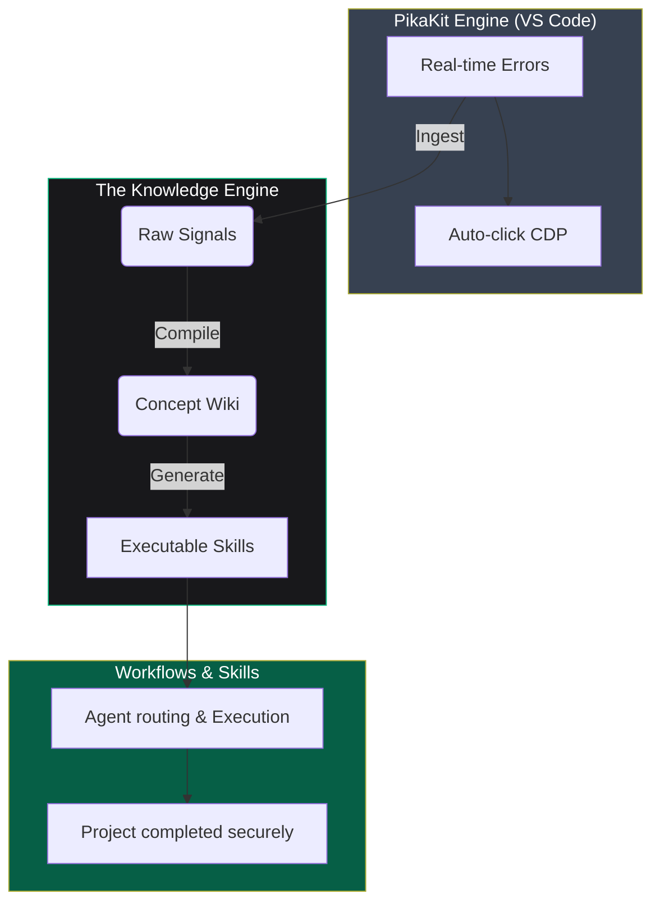

<div align="center">

# 🤖 PikaKit
### The AI Operating System for Production-Grade Development

Build production-grade features 3–5x faster — with enforced architecture, autonomous workflows, and a self-learning AI that never repeats mistakes.

PikaKit transforms any AI into a Senior Engineer — not by prompting harder, but by controlling how it executes, learns, and improves over time.

[](https://www.npmjs.com/package/pikakit)
[](https://github.com/pikakit/agent-skills)
[](https://github.com/pikakit/agent-skills)
[](https://github.com/pikakit/agent-skills)

```bash
npx pikakit
```

Used with Cursor · Windsurf · Roo Code · Cline · Antigravity

</div>

---

## ⚡ AI Coding is Broken

Today’s AI tools can write code — but they:
- Break your architecture
- Forget past mistakes
- Require constant supervision
- Produce inconsistent results

## PikaKit Fixes This

PikaKit turns AI into a deterministic engineering system:
- Enforces architecture & best practices
- Learns from every failure
- Executes workflows autonomously
- Ships production-ready code

---

## ⚡ What Makes PikaKit Different?

**Without PikaKit:**
- AI = autocomplete
- You = babysitter
- Bugs = repeated forever

**With PikaKit:**
- AI follows enforced engineering rules
- Errors become permanent knowledge
- Fixes evolve into reusable Skills
- Workflows execute end-to-end autonomously

---

## 🏗️ System Overview

```text
You → AI → PikaKit → Production Code
             ↑
      Learns from mistakes
```

### Deep Architecture



---

## 🧱 The 4 Pillars

### 1️⃣ Executable Skills
**53 battle-tested engineering capabilities** injected directly into the AI runtime — enforcing architecture, security, and performance constraints.

### 2️⃣ Autonomous Workflows
Run complex tasks with a single command:
- `/autopilot` — plan → build → test → ship
- `/think` — structured decision-making
- `/diagnose` — hypothesis-driven debugging

### 3️⃣ Self-Learning Knowledge Engine
Every failure becomes permanent:
- **Errors** → captured
- **Fixes** → compiled
- **Patterns** → turned into new Skills

### 4️⃣ IDE Execution Layer
A VS Code extension that gives AI real-world control:
- Reads errors in real-time
- Prevents destructive actions
- Handles UI interactions automatically

---

## 🛡️ Built for Safe Autonomy

PikaKit operates under strict safeguards:

- **Human approval** for critical operations
- **Automatic Git checkpoints** before risky changes
- **Multi-layer rollback system** (6 levels)
- **Zero destructive actions** without confirmation

*Autonomy without control is dangerous. PikaKit gives you both.*

---

## ⚡ Get Started in Seconds

```bash
npx pikakit
```

Then in your AI editor:
> Run `/autopilot` to rebuild auth using Next.js App Router

---

## 🧠 Not a Prompt Library. Not a Wrapper.

PikaKit is an **AI Operating System**.

It sits between your AI and your codebase — controlling execution, enforcing rules, and continuously improving outcomes.

Like how Docker standardized environments, **PikaKit standardizes AI behavior in production.**

---

## 🔥 Built for Serious Developers

Designed for teams who want:
- Production-grade AI outputs
- Deterministic behavior
- Long-term learning systems

*Not just demos. Not just prototypes.*

---

## 🚀 Stop Prompting. Start Building.

Turn your AI into a real engineer.

```bash
npx pikakit
```

<div align="center">

**PikaKit v3.9.133** · 53 Skills · 21 Agents · 19 Workflows · Strict TypeScript

[⭐ Star on GitHub](https://github.com/pikakit/agent-skills) · [Install via npm](https://www.npmjs.com/package/pikakit) · [pikakit.com](https://pikakit.com)

</div>
