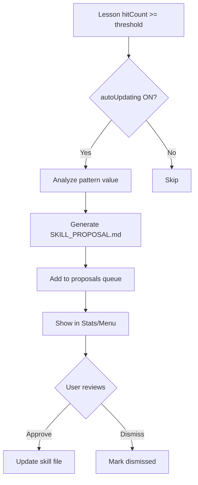

# Project Plan: Agent Skill Kit v2.1.0

## Overview

| Aspect | Value |
|--------|-------|
| Goal | Fix v2.0 weaknesses and add production-ready features |
| Timeline | 1-2 sessions |
| Complexity | Medium |
| Base Score | 7.8/10 → Target 9/10 |

---

## Stack (Unchanged)

| Layer | Choice |
|-------|--------|
| Runtime | Node.js (ESM) |
| CLI | @clack/prompts + @clack/core |
| Storage | YAML files |
| Testing | Vitest |

---

## Priority Ranking

| Priority | Feature | Impact | Effort |
|----------|---------|--------|--------|
| P1 | Auto-Updating Flow | High | Medium |
| P2 | Ignore Patterns | High | Low |
| P3 | Backup/Restore | Medium | Low |
| P4 | Export/Import Settings | Medium | Low |
| P5 | Team Sync | Medium | High |

---

## Task Breakdown

### Epic 1: Auto-Updating Flow (P1)
> Implement proposal workflow when patterns are valuable

- [ ] **Story 1.1**: Detect valuable patterns
  - [ ] Track hitCount in lessons
  - [ ] Compare with updateThreshold
  - [ ] Identify candidates

- [ ] **Story 1.2**: Generate update proposal
  - [ ] Create `SKILL_PROPOSAL.md` template
  - [ ] Include pattern analysis
  - [ ] Show before/after

- [ ] **Story 1.3**: User notification flow
  - [ ] CLI notification in Stats
  - [ ] Menu option "Review Proposals"
  - [ ] Approve/Dismiss actions

---

### Epic 2: Ignore Patterns (P2)
> Add `.agentignore` support

- [ ] **Story 2.1**: Create ignore file parser
  - [ ] Support glob patterns
  - [ ] Support comments (#)
  - [ ] Default ignores: node_modules, .git

- [ ] **Story 2.2**: Integrate with Recall
  - [ ] Filter files before scan
  - [ ] Show ignored count in stats

---

### Epic 3: Backup/Restore (P3)
> Protect lessons before changes

- [ ] **Story 3.1**: Backup command
  - [ ] `agent backup` → timestamped copy
  - [ ] Store in `.agent/backups/`

- [ ] **Story 3.2**: Restore command
  - [ ] `agent restore` → list backups
  - [ ] Select and restore

---

### Epic 4: Export/Import Settings (P4)
> Share config between projects

- [ ] **Story 4.1**: Export
  - [ ] `agent export` → JSON file
  - [ ] Include settings + lessons

- [ ] **Story 4.2**: Import  
  - [ ] `agent import <file>`
  - [ ] Merge or replace option

---

## Architecture: Auto-Updating Flow

---

## New Files

| File | Purpose |
|------|---------|
| `lib/proposals.js` | Proposal generator |
| `lib/backup.js` | Backup/restore logic |
| `lib/ignore.js` | Ignore file parser |
| `lib/export.js` | Export/import settings |
| `lib/ui/proposals-ui.js` | Proposals review UI |
| `.agentignore.default` | Default ignore template |

---

## Updated Files

| File | Changes |
|------|---------|
| `lib/ui/index.js` | Add "Proposals" menu option |
| `lib/recall.js` | Integrate ignore patterns |
| `lib/stats.js` | Show proposal notifications |
| `bin/ag-smart.js` | Add backup/restore subcommands |

---

## Verification Checklist

- [ ] Auto-Updating flow works end-to-end
- [ ] `.agentignore` excludes files from scan
- [ ] Backup creates timestamped copy
- [ ] Restore recovers from backup
- [ ] Export/Import preserves data
- [ ] All existing tests still pass
- [ ] New tests added for new features

---

## Recommended Order

| Phase | Epic | Estimate |
|-------|------|----------|
| 1 | Epic 2: Ignore Patterns | 30m |
| 2 | Epic 3: Backup/Restore | 30m |
| 3 | Epic 4: Export/Import | 30m |
| 4 | Epic 1: Auto-Updating | 1-2h |

> Start with quick wins (P2-P4) then tackle the complex feature (P1).

---

## Next Steps

After approval:
1. Run `/build Epic 2` for ignore patterns
2. Continue with remaining epics
3. Run `/validate` after completion
