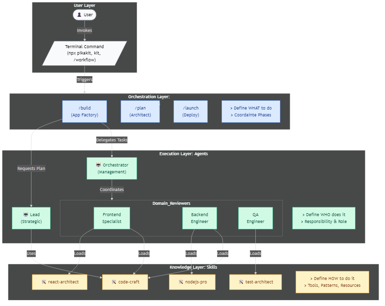

# PikaKit Documentation

> **67 Skills · 26 Agents · 25 Workflows** — Your ideas, our engineering.

---

## ⚡ Quick Start

```bash
npx pikakit                           # Install
/build a todo app with authentication  # Create
/autopilot e-commerce with Stripe      # Full automation
```

→ [Getting Started](getting-started.md) for scenarios and command reference.

---

## 📐 Design Guides

Standards for extending PikaKit — read these before creating new components.

| Guide | Purpose |
|-------|---------|
| [Agent Design](agent-design-guide.md) | Agent structure, contracts, skill assignments |
| [Skill Design](skill-design-guide.md) | SKILL.md format, frontmatter, categories |
| [Workflow Design](workflow-design-guide.md) | Workflow phases, chains, `$ARGUMENTS` |

---

## 📖 Guides

Step-by-step tutorials for common development scenarios.

| Guide | What You'll Build |
|-------|-------------------|
| [Greenfield Projects](guides/greenfield-projects.md) | New app from scratch |
| [Feature Development](guides/feature-development.md) | Complete feature lifecycle |
| [Building a REST API](guides/building-rest-api.md) | API with auth & validation |
| [Implementing Auth](guides/implementing-authentication.md) | OAuth, JWT, session auth |
| [Integrating Payments](guides/integrating-payments.md) | Stripe, SePay, Polar |
| [Code Review](guides/code-review.md) | Multi-layer review process |
| [Debugging Workflow](guides/debugging-workflow.md) | Root cause analysis |
| [Refactoring Code](guides/refactoring-code.md) | Safe modernization |
| [Optimizing Performance](guides/optimizing-performance.md) | Core Web Vitals, caching |
| [Documentation Workflow](guides/documentation-workflow.md) | Auto-generate docs |
| [Context Engineering](guides/context-engineering.md) | Optimize AI context |
| [Knowledge Graph](guides/gitlab-knowledge-graph.md) | Semantic code analysis |

---

## 📋 Reference

| Reference | Description |
|-----------|-------------|
| [Scripts](reference/scripts.md) | Validation & automation scripts |
| [Skill Standard](reference/skill-standard.md) | Skill creation specification |
| [Python Strategy](reference/python-strategy.md) | Hybrid JS/Python architecture |

---

## 🗺️ Architecture Diagrams

| Diagram | Format |
|---------|--------|
| [Agent-Skill-Workflow Relationship](diagrams/agent-skill-workflow-relationship.mmd) | Mermaid |
| [PikaKit Architecture](diagrams/pika-architecture.mmd) | Mermaid |
| [Skill-Workflow Relationship](diagrams/skill-workflow-relationship.mmd) | Mermaid |



---

## 📂 Structure

```
docs/
├── README.md                    ← You are here
├── getting-started.md           # User guide with scenarios
├── agent-design-guide.md        # Agent creation standard
├── skill-design-guide.md        # Skill creation standard
├── workflow-design-guide.md     # Workflow creation standard
├── guides/                      # 15 how-to tutorials
├── reference/                   # 3 technical specs
└── diagrams/                    # Architecture diagrams
```

---

## 🔗 Related

| Resource | Path |
|----------|------|
| AI Rules & Protocols | [GEMINI.md](../.agent/GEMINI.md) |
| Agents | [.agent/agents/](../.agent/agents/) |
| Skills | [.agent/skills/](../.agent/skills/) |
| Workflows | [.agent/workflows/](../.agent/workflows/) |

---

## 📊 PikaKit at a Glance

| Component | Count | Location |
|-----------|-------|----------|
| **Agents** | 26 (21 domain + 5 meta) | `.agent/agents/` |
| **Skills** | 67 | `.agent/skills/` |
| **Workflows** | 25 | `.agent/workflows/` |
| **Guides** | 15 | `docs/guides/` |
| **Design Guides** | 3 | `docs/` |
