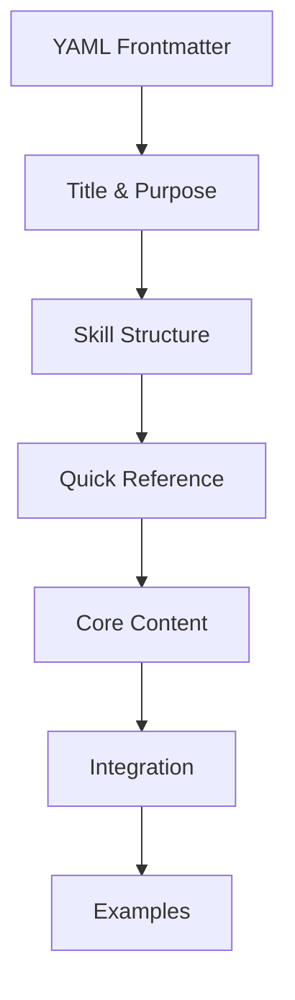

# Skill Design Guide

> **PikaKit v3.2** | Standard formula for creating new skills

---

## Skill Anatomy



---

## Standard Structure

### 1. YAML Frontmatter (REQUIRED)

```yaml
---
name: skill-name
description: >-
  Multi-line description of what the skill does.
  Include trigger keywords and coordination info.
  Triggers on: keyword1, keyword2.
  Coordinates with: other-skill, another-skill.
metadata:
  category: "core|design|framework|testing|devops"
  version: "1.0.0"
  triggers: "comma, separated, keywords"
  coordinates_with: "skill1, skill2"
  success_metrics: "metric1, metric2"
---
```

**Key Fields:**

| Field | Required | Description |
|-------|----------|-------------|
| `name` | ✅ | kebab-case identifier |
| `description` | ✅ | Multi-line with triggers |
| `metadata.category` | ✅ | Skill category |
| `metadata.version` | ⭐ | SemVer version |
| `metadata.triggers` | ⭐ | Activation keywords |
| `metadata.coordinates_with` | ⭐ | Related skills |

---

### 2. Title & Purpose

```markdown
# Skill Name

> **Purpose:** Brief one-line summary of what this skill does

---

## 🎯 Purpose

[One paragraph explaining what the skill does and its key differentiator.]
```

---

### 3. Skill Structure (RECOMMENDED)

```markdown
## 📂 Skill Structure

\```
skill-name/
├── SKILL.md           # This file (entry point, <200 lines)
├── references/        # Detailed documentation (on-demand)
├── scripts/           # Executable JS scripts
├── scripts-js/        # JavaScript implementation
├── data/              # CSV/JSON data files
└── assets/            # Images, templates
\```
```

**200-Line Rule:**
- SKILL.md should be <200 lines
- Move detailed docs to `references/`
- Move code to `scripts/` or `scripts-js/`

---

### 4. Quick Reference (REQUIRED)

```markdown
## 🔧 Quick Reference

### [Primary Action]

\```bash
node .agent/skills/skill-name/scripts/main.js "<query>" [--options]
\```

### [Secondary Action]

\```bash
node .agent/skills/skill-name/scripts/other.js --flag
\```
```

Provide ready-to-copy commands.

---

### 5. Core Content (VARIES BY TYPE)

**For Process Skills (debug-pro, auto-learner):**
```markdown
## [N]-Phase Process

### Phase 1: [Name]
**Goal:** [What this phase accomplishes]
[Steps, checklists, templates]

### Phase 2: [Name]
**Goal:** [What this phase accomplishes]
[Steps, checklists, templates]
```

**For Database Skills (studio):**
```markdown
## 📊 Database Contents

| Category | Count | Description |
|----------|-------|-------------|
| **[Type]** | N | Brief description |
```

**For Expert Skills (typescript-expert, mobile-developer):**
```markdown
## Capabilities

### [Area 1]
- Capability bullet points
- Specific tools and versions

### [Area 2]
- More capabilities
```

---

### 6. Scripts Section (FOR SKILLS WITH SCRIPTS)

```markdown
## Scripts

| Script | Purpose | Command |
|--------|---------|---------|
| `script_name.js` | What it does | `--flag "value"` |
| `other_script.js` | What it does | `--option` |

### [Script Name]

\```bash
# Usage
node .agent/skills/skill-name/scripts/script_name.js --help

# Example
node .agent/skills/skill-name/scripts/script_name.js --scan all
\```
```

---

### 7. Meta-Agents Integration (RECOMMENDED)

```markdown
## 🤖 Meta-Agents Integration

| Phase | Agent | Action |
| ----- | ----- | ------ |
| **[Phase]** | `agent` | What they do |
| **[Phase]** | `agent` | What they do |

\```
Flow diagram showing integration
\```
```

---

### 8. When to Use (REQUIRED)

```markdown
## When to Use

| Situation | Approach |
|-----------|----------|
| [Trigger condition] | [What to do] |
| [Another trigger] | [What to do] |
```

---

### 9. Integration/Related

```markdown
## 🔗 Related

| Item | Type | Purpose |
|------|------|---------|
| `/workflow` | Workflow | User-facing command |
| `agent-name` | Agent | Uses this skill |
| `other-skill` | Skill | Companion skill |
```

---

### 10. Example Interactions (OPTIONAL)

```markdown
## Example Interactions

- "Task description that would invoke this skill"
- "Another example task"
```

---

## Complete Template

```markdown
---
name: skill-name
description: >-
  What this skill does. Triggers on: keywords.
  Coordinates with: other-skills.
metadata:
  category: "core"
  version: "1.0.0"
  triggers: "keyword1, keyword2"
  coordinates_with: "skill1, skill2"
  success_metrics: "metric1"
---

# Skill Name

> **Purpose:** One-line summary

---

## 🎯 Purpose

[Detailed purpose paragraph.]

---

## 📂 Skill Structure

\```
skill-name/
├── SKILL.md
├── scripts/
└── references/
\```

---

## 🔧 Quick Reference

### [Action]

\```bash
node .agent/skills/skill-name/scripts/main.js "<query>"
\```

---

## Core Content

### [Section based on skill type]

---

## 🤖 Meta-Agents Integration

| Phase | Agent | Action |
| ----- | ----- | ------ |
| **[Phase]** | `agent` | Action |

---

## When to Use

| Situation | Approach |
|-----------|----------|
| [Trigger] | [Action] |

---

## 🔗 Related

| Item | Type | Purpose |
|------|------|---------|
| `/workflow` | Workflow | Command |
| `agent` | Agent | Uses skill |

---

## 📖 References

For detailed documentation, see:
- `references/` - Detailed docs
- `scripts/` - Implementation
```

---

## Skill Categories

| Category | Description | Examples |
|----------|-------------|----------|
| `core` | Essential functionality | debug-pro, auto-learner, problem-checker |
| `design` | UI/UX and design | studio, design-system |
| `framework` | Language/Framework expertise | typescript-expert, react-patterns |
| `testing` | Test automation | test-architect, e2e-automation |
| `devops` | Deployment/Operations | gitops, observability |
| `mobile` | Mobile development | mobile-developer, mobile-design |
| `security` | Security practices | security-audit, mobile-security |

---

## Skill Types

| Type | Characteristics | Examples |
|------|-----------------|----------|
| **Process** | Multi-phase methodology | debug-pro (4-phase) |
| **Database** | Searchable data | studio (50+ styles) |
| **Expert** | Deep domain knowledge | typescript-expert |
| **Automation** | Scripts & tooling | auto-learner (sensors) |
| **Hybrid** | Mix of above | mobile-developer |

---

## Checklist

Before publishing a skill:

- [ ] Frontmatter complete (name, description, metadata)
- [ ] SKILL.md is <200 lines
- [ ] Purpose section is clear
- [ ] Quick Reference has copy-paste commands
- [ ] Core content matches skill type
- [ ] Meta-agents integration if applicable
- [ ] When to Use section included
- [ ] Related section links workflows/agents
- [ ] Scripts documented with examples
- [ ] Detailed docs in `references/` if needed

---

⚡ PikaKit v3.2.0
Composable Skills. Coordinated Agents. Intelligent Execution.
