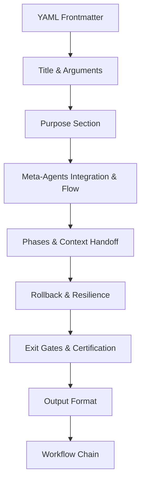

# Workflow Design Guide

> **PikaKit v3.9.127** | Standard formula for creating new FAANG-Grade workflows

---

## Workflow Anatomy



---

## Standard Structure

### 1. YAML Frontmatter (REQUIRED)

> **FAANG RULE:** Explicit Dependency Injection. You must declare required skills and agents.

```yaml
---
description: One-line summary. Action verb + outcome + method.
chain: optional-chain-id  # For auto-chaining
skills: [skill-A, skill-B] # Explicit dependencies (NEW)
agents: [orchestrator, domain-agent] # Required Meta-Agents/Domain Agents (NEW)
---
```

**Examples:**
- ✅ `Ideation engine with 3+ alternatives analysis.`
- ✅ `Test automation with Vitest/Playwright.`
- ❌ `A workflow for building things` (too vague)

---

### 2. Title & Purpose

```markdown
# /workflow-name - Descriptive Title

$ARGUMENTS

---

## Purpose

[One paragraph explaining what this workflow does and its key differentiator.]
```

---

### 3. Meta-Agents Integration (REQUIRED)

```markdown
## 🤖 Meta-Agents Integration

| Phase | Agent | Action |
| ----- | ----- | ------ |
| **Pre-Execute** | `assessor` | Evaluate risk and check Auto-Learned Patterns |
| **Execution** | `recovery` | Save checkpoints |
| **Post-Execute** | `learner` | Log patterns |
```

**Available Meta-Agents:**
- `orchestrator` - Runtime execution control
- `assessor` - Risk evaluation
- `recovery` - State management/rollback
- `critic` - Conflict resolution
- `learner` - Pattern learning

---

### 4. Phases & Context Handoff (CORE)

> **FAANG RULE:** Context Preservation (0.5-I). Input and Output passed between agents must be strictly defined.

```markdown
## 🔴 MANDATORY: [Protocol Name]

### Phase 1: Pre-Execute & Self-Healing
> **Rule 0.5-K:** Auto-learned pattern check.
1. Check `.agent/skills/auto-learned/patterns/` for past failures before proceeding.

### Phase 2: [Name]

| Field | Value |
|-------|-------|
| **INPUT** | Original Request, Previous Work, Current Plan |
| **OUTPUT** | Concrete Deliverable |
| **AGENTS** | `domain-agent` |
| **SKILLS** | `skill-A` |

[Clear steps with checkboxes or code blocks]

### Phase N: [Final Phase]
[Verification/completion criteria]
```

**Design Tips:**
- Use `🔴 MANDATORY` for critical phases
- Include `// turbo` comments for auto-executable steps
- Number phases sequentially
- Each phase should have clear INPUT → OUTPUT mappings

---

### 5. OpenTelemetry & Audit Logging (FAANG OBS)

> **FAANG RULE:** All executable scripts and `// turbo` shell commands should be logged.

Whenever making automated shell commands, prefix with telemetry (if available) or assume wrapping scripts will log execution. 

**Example Node script execution:**
```bash
// turbo
node .agent/skills/context-engineering/scripts/context_analyzer.ts --telemetry-span="phase-name"
```
Or simply mandate immutable logging behavior natively inside the invoked scripts.

---

### 6. Rollback & Resilience (FAANG RESILIENCE)

> **FAANG RULE:** Failed workflows must never leave the repository in a broken state.

```markdown
## 🔙 Rollback & Recovery
- **Checkpoint Gate:** Stash existing changes or trigger `git commit -m "chore(checkpoint): pre-workflow"` before altering files.
- **Rollback Condition:** If any Phase fails and cannot auto-fix, run `git checkout -- .` (or equivalent) and invoke `learner` meta-agent.
```

---

### 7. Problem Verification / Exit Gates (ZERO-TRUST)

> **FAANG RULE:** Never complete a workflow or notify user if verification fails. (Tier 0.5-G)

```markdown
## ⛔ MANDATORY: Exit Gates

Before completing the workflow, ensure the following strictly passes:
1. `@[current_problems] == 0` (Auto-fix minor issues first)
2. Compilations / Tests Pass
3. (If Applicable) Project builds/runs.

**CRITICAL: Do not trigger Completion or notify_user until these gates pass.**
If `@[current_problems] > 0` after auto-fix, stop and notify user. Do not mark workflow as Complete.
```

---

### 8. Output Format (REQUIRED)

```markdown
## Output Format

\```markdown
## 🎯 [Workflow Output Title]

### Status
| Column | Data |
|--------|------|
| Key | Value |

### Next Steps
- [ ] Action item 1
- [ ] Action item 2
\```
```

---

### 9. Workflow Chain (REQUIRED)

```markdown
## 🔗 Workflow Chain

\```mermaid
graph LR
    A["/previous"] --> B["/current"]
    B --> C["/next"]
    style B fill:#10b981
\```

| After /current | Run | Purpose |
|----------------|-----|---------|
| Condition 1 | `/next-workflow` | Reason |
| Condition 2 | `/alternative` | Reason |

**Handoff to /next:**
\```markdown
[Completion message and handoff context]
\```
```

---

## Complete Template

```markdown
---
description: [Action verb] + [outcome] + [method/differentiator].
skills: [skill-A, skill-B]
agents: [orchestrator, domain-agent]
---

# /workflow-name - Descriptive Title

$ARGUMENTS

---

## Purpose

[What it does. Key differentiator. Integrated agents.]

---

## 🤖 Meta-Agents Integration

| Phase | Agent | Action |
| ----- | ----- | ------ |
| **Pre-Flight** | `assessor` | Evaluate risk & auto-learned patterns |
| **Execution** | `orchestrator`| Assign domain agents |
| **Safety** | `recovery` | Save checkpoint |

---

## 🔴 MANDATORY: [Protocol Name]

### Phase 1: Pre-flight & Auto-Learned Context
1. Read `.agent/skills/auto-learned/patterns/` relevant to this workflow.
2. Trigger `recovery` agent to run Checkpoint (`git commit -m "chore(checkpoint): pre-workflow-name"`).

### Phase 2: [Execution Phase]

| Field | Value |
|-------|-------|
| **INPUT** | $ARGUMENTS & Learned Context |
| **OUTPUT** | Structured Plan / Mod |
| **AGENTS** | `domain-agent` |
| **SKILLS** | `skill-A` |

[Steps...]

---

## ⛔ MANDATORY: Exit Gates / Certification

**CRITICAL: Do not trigger Completion or notify_user until these gates pass.**
1. Read `@[current_problems]`. Auto-fix if `> 0`. 
2. If `@[current_problems] > 0` after auto-fix, stop and notify user. Do not mark workflow as Complete.

---

## 🔙 Rollback Path

If the Exit Gates fail and cannot be resolved automatically:
1. Restore to pre-workflow checkpoint.
2. Log failure via `learner` meta-agent.

---

## Output Format

\```markdown
## 🎯 [Output Title]

### Status
[Checklist of completed items]

### Next Steps    
[Actionable items]
\```

---

## 🔗 Workflow Chain

\```mermaid
graph LR
    A["/previous"] --> B["/workflow-name"]
    B --> C["/next"]
    style B fill:#10b981
\```

| After /workflow-name | Run | Purpose |
|----------------------|-----|---------|
| Condition | `/next` | Reason |

**Handoff:**
\```markdown
Completion message.
\```
```

---

## Checklist

Before publishing a FAANG-grade workflow:

- [ ] Frontmatter includes explicit `skills` and `agents` (Dependency Injection)
- [ ] Purpose section explains the "what" and "why"
- [ ] Meta-agents integrated for Pre-flight, Execution, Safety
- [ ] Phase 1 enforces Auto-Learned pattern checks
- [ ] Context handoff (Input/Output/Agents/Skills) explicitly mapped per Phase
- [ ] Exit Gates strictly enforces `@[current_problems] == 0`
- [ ] Rollback path is defined
- [ ] Telemetry logging wrapped for `// turbo` shell scripts
- [ ] Workflow chain shows before/after connections

---

⚡ PikaKit v3.9.127
Composable Skills. Coordinated Agents. Intelligent Execution.
