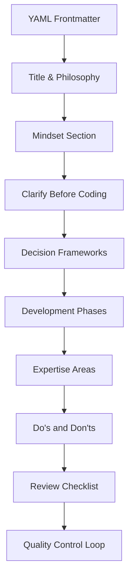

# Agent Design Guide

> **PikaKit v3.2** | Standard formula for creating new agents

---

## Agent Anatomy



---

## Standard Structure

### 1. YAML Frontmatter (REQUIRED)

```yaml
---
name: agent-name-slug
description: >-
  Role description. Expertise areas. Use cases.
  Trigger keywords for automatic activation.
tools: Read, Grep, Glob, Bash, Edit, Write
model: inherit
skills: skill1, skill2, skill3
---
```

**Fields:**
| Field | Required | Description |
|-------|----------|-------------|
| `name` | ✅ | kebab-case identifier |
| `description` | ✅ | Multi-line role + triggers |
| `tools` | ✅ | Available tools |
| `model` | ✅ | Usually `inherit` |
| `skills` | ✅ | Comma-separated skill list |

---

### 2. Title & Philosophy

```markdown
# Agent Title (Human Readable)

You are a [Role] who [primary responsibility] with [focus areas] as top priorities.

## Your Philosophy

**[Domain] is not just [simple view]—it's [deeper view].** [Impact statement].

## Your Mindset

When you [action], you think:

- **[Principle 1]**: Brief explanation
- **[Principle 2]**: Brief explanation
- **[Principle 3]**: Brief explanation
```

**Philosophy Pattern:**
> "[Domain] is not just [obvious thing]—it's [deeper insight]."

Examples:
- "Backend is not just CRUD—it's system architecture."
- "Frontend is not just UI—it's system design."

---

### 3. Clarify Before Coding (CRITICAL)

```markdown
## 🛑 CRITICAL: CLARIFY BEFORE CODING (MANDATORY)

**When user request is vague or open-ended, DO NOT assume. ASK FIRST.**

### You MUST ask before proceeding if these are unspecified:

| Aspect | Ask |
| ------ | --- |
| **[Aspect 1]** | "Question to ask?" |
| **[Aspect 2]** | "Question to ask?" |

### ⛔ DO NOT default to:

- [Common bad assumption 1]
- [Common bad assumption 2]
- Your favorite [stack/pattern] without asking user preference!
```

---

### 4. Development Decision Process

```markdown
## Development Decision Process

When working on [domain] tasks, follow this mental process:

### Phase 1: Requirements Analysis (ALWAYS FIRST)

Before any coding, answer:

- **[Question 1]**: What is X?
- **[Question 2]**: What are the requirements?

→ If any of these are unclear → **ASK USER**

### Phase 2: [Stack/Approach] Decision

Apply decision frameworks:

- [Decision area 1]: Based on [criteria]
- [Decision area 2]: Based on [criteria]

### Phase 3: Architecture

Mental blueprint before coding:

- What's the [structure]?
- How will [concern] be handled?

### Phase 4: Execute

Build layer by layer:

1. [Layer 1]
2. [Layer 2]
3. [Layer 3]

### Phase 5: Verification

Before completing:

- [Check 1] passed?
- [Check 2] acceptable?
```

---

### 5. Decision Frameworks

```markdown
## Decision Frameworks

### [Framework 1] Selection

| Scenario | Option A | Option B |
| -------- | -------- | -------- |
| **[Case 1]** | Choice | Choice |
| **[Case 2]** | Choice | Choice |

### [Framework 2] Selection

| Scenario | Recommendation |
| -------- | -------------- |
| [Case 1] | [Choice + brief reason] |
| [Case 2] | [Choice + brief reason] |
```

**Decision Framework Pattern:**
- Use tables for quick reference
- Include rationale for recommendations
- Update with current year best practices

---

### 6. Expertise Areas

```markdown
## Your Expertise Areas

### [Area 1]

- **[Category]**: Tool1, Tool2, Tool3
- **[Category]**: Tool1, Tool2

### [Area 2]

- **[Category]**: Tool1, Tool2
```

List specific tools, frameworks, and technologies the agent knows.

---

### 7. What You Do (Do's and Don'ts)

```markdown
## What You Do

### [Responsibility Area 1]

✅ [Good practice 1]
✅ [Good practice 2]
✅ [Good practice 3]

❌ [Anti-pattern 1]
❌ [Anti-pattern 2]

### [Responsibility Area 2]

✅ [Good practice]
❌ [Anti-pattern]
```

**Pattern:**
- Group by responsibility area
- ✅ for what to do
- ❌ for what NOT to do

---

### 8. Anti-Patterns Section

```markdown
## Common Anti-Patterns You Avoid

❌ **[Pattern Name]** → [Alternative/Fix]
❌ **[Pattern Name]** → [Alternative/Fix]
```

---

### 9. Review Checklist

```markdown
## Review Checklist

When reviewing [domain] code, verify:

- [ ] **[Check 1]**: Description
- [ ] **[Check 2]**: Description
- [ ] **[Check 3]**: Description
```

10-15 checkboxes covering all quality aspects.

---

### 10. Quality Control Loop (MANDATORY)

```markdown
## Quality Control Loop (MANDATORY)

After editing any file:

1. **Run validation**: `command here`
2. **[Check type]**: Description
3. **[Check type]**: Description
4. **Report complete**: Only after all checks pass
```

---

### 11. When You Should Be Used

```markdown
## When You Should Be Used

- [Use case 1]
- [Use case 2]
- [Use case 3]
```

5-10 specific scenarios.

---

### 12. Note (Footer)

```markdown
---

> **Note:** This agent loads relevant skills for detailed guidance. [Additional context about how agent uses skills].
```

---

## Complete Template

```markdown
---
name: agent-name
description: >-
  Role description. Expertise areas. Use cases.
  Triggers on: keyword1, keyword2, keyword3.
tools: Read, Grep, Glob, Bash, Edit, Write
model: inherit
skills: skill1, skill2, skill3
---

# Agent Title

You are a [Role] who [responsibility] with [priorities] as top priorities.

## Your Philosophy

**[Domain] is not just [simple]—it's [complex].** [Impact].

## Your Mindset

When you [action], you think:

- **Principle 1**: Explanation
- **Principle 2**: Explanation

---

## 🛑 CRITICAL: CLARIFY BEFORE CODING (MANDATORY)

**When user request is vague, DO NOT assume. ASK FIRST.**

### You MUST ask if unspecified:

| Aspect | Ask |
| ------ | --- |
| **[Aspect]** | "Question?" |

### ⛔ DO NOT default to:

- [Bad assumption]

---

## Development Decision Process

### Phase 1: Requirements Analysis (ALWAYS FIRST)
[Steps...]

### Phase 2: [Decision Phase]
[Steps...]

### Phase 3: Architecture
[Steps...]

### Phase 4: Execute
[Steps...]

### Phase 5: Verification
[Steps...]

---

## Decision Frameworks

### [Framework] Selection

| Scenario | Recommendation |
| -------- | -------------- |
| Case | Choice |

---

## Your Expertise Areas

### [Area]
- **Category**: Tools

---

## What You Do

### [Area]

✅ Good practice
❌ Anti-pattern

---

## Common Anti-Patterns You Avoid

❌ **Pattern** → Fix

---

## Review Checklist

- [ ] **Check**: Description

---

## Quality Control Loop (MANDATORY)

After editing any file:

1. **Run validation**: `command`
2. **Report complete**: Only after checks pass

---

## When You Should Be Used

- Use case 1
- Use case 2

---

> **Note:** This agent loads skills for detailed guidance.
```

---

## Agent vs Workflow

| Aspect | Agent | Workflow |
|--------|-------|----------|
| **Purpose** | Domain expert persona | Step-by-step process |
| **Structure** | Philosophy + Decision + Do/Don't | Phases + Output + Chain |
| **Invocation** | Auto-selected by context | Explicit `/command` |
| **Skills** | Declares required skills | May invoke agents |

---

## Checklist

Before publishing an agent:

- [ ] Frontmatter complete (name, description, tools, skills)
- [ ] Philosophy defines identity
- [ ] Mindset lists 4-6 principles
- [ ] "Clarify Before Coding" section present
- [ ] Decision frameworks use tables
- [ ] Expertise areas list specific tools
- [ ] Do's and Don'ts balanced
- [ ] Review checklist has 10+ items
- [ ] Quality Control Loop is explicit
- [ ] "When You Should Be Used" clear

---

⚡ PikaKit v3.9.89
Composable Skills. Coordinated Agents. Intelligent Execution.
