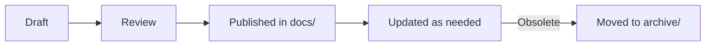

# Documentation Design Guide

> **PikaKit v3.2** | Standard formula for documentation structure

---

## Docs Folder Structure

```
docs/
├── README.md              # Index/navigation hub
├── getting-started.md     # User guide (scenarios, commands)
├── guides/                # How-to guides (tutorials)
│   ├── feature-development.md
│   ├── building-rest-api.md
│   ├── documentation-workflow.md
│   ├── debugging-workflow.md
│   ├── refactoring-code.md
│   ├── code-review.md
│   ├── context-engineering.md
│   ├── migration.md
│   ├── publishing.md
│   └── versioning.md
├── reference/             # Technical reference (specifications)
│   ├── scripts.md
│   ├── skill-standard.md
│   └── python-strategy.md
├── archive/               # Deprecated/historical docs
├── AGENT_DESIGN_GUIDE.md  # Agent creation template
├── WORKFLOW_DESIGN_GUIDE.md # Workflow creation template
├── SKILL_DESIGN_GUIDE.md  # Skill creation template
└── DOCS_GUIDE.md          # This file
```

---

## Document Types

### 1. README.md (Index)

**Purpose:** Navigation hub, quick links to all docs.

**Structure:**
```markdown
# Project Documentation

> Tagline

---

## 📚 Quick Links

| Document | Description |
|----------|-------------|
| [Getting Started](getting-started.md) | User guide |

### Guides 
| Guide | Description |
|-------|-------------|
| [Guide 1](guides/guide1.md) | Brief |

### Reference
| Reference | Description |
|-----------|-------------|
| [Ref 1](reference/ref1.md) | Brief |

---

## 📂 Structure

\```
docs/
├── ...
\```

---

## 🚀 Getting Started

1. **Install**: Command
2. **Use**: Quick start
3. **Learn**: Link to guide

---

## 🔗 Related

- [File](../path) - Description
```

---

### 2. getting-started.md (User Guide)

**Purpose:** End-user onboarding, scenarios, command reference.

**Structure:**
```markdown
# 📖 Project - User Guide

> What the project does in simple terms.

---

## 🎯 What This Does

| You want... | We help you... |
|-------------|----------------|
| Goal 1 | Solution 1 |

---

## 🗺️ Command Map

\```
ASCII diagram showing workflow
\```

---

## 📚 SCENARIOS

### 🆕 SCENARIO 1: [Name]

> **Situation:** When to use this scenario

#### Workflow:
\```
Step-by-step visual diagram
\```

#### Summary:
\```
/command1 → /command2 → /command3
\```

---

### 📦 SCENARIO 2: [Name]
[Same pattern...]

---

## 📊 COMMAND SUMMARY

| Command | When to use | Output |
|---------|-------------|--------|
| `/cmd` | Situation | Result |

---

## 💡 TIPS

1. **Scenario 1:** Tip
2. **Scenario 2:** Tip
```

**Key Principles:**
- Use Vietnamese or target language for user-facing docs
- Visual diagrams (ASCII art) for workflow visualization
- Tables for quick reference
- Scenarios grouped by user intent

---

### 3. guides/*.md (How-To Guides)

**Purpose:** Step-by-step tutorials for specific tasks.

**Structure:**
```markdown
# [Topic] Guide

> Brief description of what this guide covers.

---

## Prerequisites

- Requirement 1
- Requirement 2

---

## Overview

[Brief explanation of what we'll accomplish]

---

## Step 1: [Action]

\```bash
command here
\```

[Explanation]

---

## Step 2: [Action]

[Continue pattern...]

---

## Next Steps

- [ ] What to do next
- [ ] Related guide

---

## Troubleshooting

| Problem | Solution |
|---------|----------|
| Error X | Fix Y |
```

**Guide Categories:**
| Type | Examples | Purpose |
|------|----------|---------|
| Setup | Installation, config | Getting started |
| Migration | Python→JS, v1→v2 | Transitioning |
| Integration | Publishing, CI/CD | Connecting |
| Best Practices | Context, patterns | Optimization |

---

### 4. reference/*.md (Technical Reference)

**Purpose:** Detailed specifications, API docs, standards.

**Structure:**
```markdown
# [Topic] Reference

> Technical specification for [topic].

---

## Overview

[What this reference covers]

---

## [Category 1]

### [Item]

| Property | Value |
|----------|-------|
| Type | X |
| Required | Yes/No |

**Description:** [Details]

**Example:**
\```
code example
\```

---

## [Category 2]

[Continue pattern...]

---

## API/Commands

| Command | Arguments | Output |
|---------|-----------|--------|
| `cmd` | `--flag` | Result |

---

## See Also

- [Related Reference](other.md)
```

**Reference Categories:**
| Type | Examples | Purpose |
|------|----------|---------|
| Scripts | Validation scripts | Tool documentation |
| Standards | Skill standard | Specifications |
| Architecture | Python strategy | Design rationale |

---

## Writing Guidelines

### Language

| Audience | Language | Tone |
|----------|----------|------|
| End users | Vietnamese/Target | Friendly, simple |
| Developers | English | Technical, precise |
| Contributors | English | Detailed, formal |

### Formatting

| Element | Use |
|---------|-----|
| Tables | Quick reference, comparisons |
| ASCII diagrams | Workflow visualization |
| Code blocks | Commands, examples |
| Emoji headers | Section navigation (📚 🎯 💡) |
| Blockquotes | Important notes, tips |

### Structure Rules

1. **Start with a hook:** Tagline or purpose
2. **Use visual hierarchy:** Headers, tables, diagrams
3. **Provide examples:** Real, copy-paste ready
4. **End with next steps:** What to do after reading

---

## Document Lifecycle



| Stage | Location | Action |
|-------|----------|--------|
| Draft | Brain folder | Initial creation |
| Published | docs/ folder | Active documentation |
| Archived | docs/archive/ | Kept for reference |

---

## Checklist

Before publishing documentation:

- [ ] Correct folder location (guides/, reference/, or root)
- [ ] README.md updated with new link
- [ ] Consistent formatting with other docs
- [ ] Tables for quick reference
- [ ] Examples are copy-paste ready
- [ ] Next steps/related links included
- [ ] Appropriate language for audience

---

⚡ PikaKit v3.2.0
Composable Skills. Coordinated Agents. Intelligent Execution.
