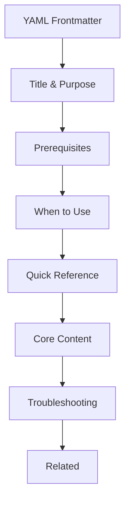

# Skill Design Guide

> **PikaKit v3.2** | Standard formula for creating new skills

---

## Skill Anatomy



---

## Directory Structure

```
skill-name/
├── SKILL.md           # Entry point (<200 lines)
├── references/        # Detailed documentation
├── scripts/           # Executable JS/Python
├── data/              # CSV/JSON data files
└── assets/            # Images, templates
```

**200-Line Rule:** Keep SKILL.md concise, move details to `references/`.

---

## Standard Sections

### 1. YAML Frontmatter (REQUIRED)

```yaml
---
name: skill-name
description: >-
  What this skill does. Triggers on: keywords.
  Coordinates with: other-skills.
metadata:
  category: "core|design|framework|testing|devops|ai|tools"
  version: "1.0.0"
  triggers: "keyword1, keyword2"
  coordinates_with: "skill1, skill2"
  success_metrics: "metric1, metric2"
---
```

| Field | Required | Description |
|-------|----------|-------------|
| `name` | ✅ | kebab-case identifier |
| `description` | ✅ | Multi-line with triggers |
| `metadata.category` | ✅ | Skill category |
| `metadata.triggers` | ⭐ | Activation keywords |

---

### 2. Title & Purpose

```markdown
# Skill Name

> Brief one-line summary of what this skill does.

---
```

---

### 3. Prerequisites (RECOMMENDED)

```markdown
## Prerequisites

**Installation:**
```bash
npm install dependency
```

**API Access:**
- API key from [provider](https://example.com)
- OR environment variable `API_KEY`
```

Document dependencies, API keys, and setup requirements.

---

### 4. When to Use (REQUIRED)

```markdown
## When to Use

| Situation | Approach |
|-----------|----------|
| [Trigger condition] | [What to do] |
| [Another trigger] | [Reference file] |
```

---

### 5. Quick Reference (REQUIRED)

```markdown
## Quick Start

```bash
node .agent/skills/skill-name/scripts/main.js --option
```
```

Provide ready-to-copy commands.

---

### 6. Core Content (VARIES BY TYPE)

**Process Skills:**
```markdown
## [N]-Phase Process

### Phase 1: [Name]
**Goal:** [What this phase accomplishes]
```

**Database Skills:**
```markdown
## Database Contents

| Category | Count | Description |
|----------|-------|-------------|
| Type | N | Brief |
```

**Expert Skills:**
```markdown
## Capabilities

| Area | Description |
|------|-------------|
| [Domain] | What it handles |
```

---

### 7. Content Map (FOR MULTI-FILE SKILLS)

```markdown
## 📑 Content Map

| File | Description | When to Read |
|------|-------------|--------------|
| `references/api.md` | API patterns | API design |
| `references/deploy.md` | Deployment | Production |
```

---

### 8. Troubleshooting (RECOMMENDED)

```markdown
## Troubleshooting

| Problem | Solution |
|---------|----------|
| Port in use | Auto-increments |
| API error | Check API key |
```

---

### 9. Related (REQUIRED)

```markdown
## 🔗 Related

| Item | Type | Purpose |
|------|------|---------|
| `/workflow` | Workflow | Command |
| `skill-name` | Skill | Companion |
```

---

## Activation Patterns

Skills activate through:

| Trigger Type | Example |
|--------------|---------|
| **Keywords** | "Midjourney", "deploy", "debug" |
| **Task Type** | "Build API", "Optimize performance" |
| **Explicit** | "Use skill-name to..." |

**In SKILL.md:**
```yaml
metadata:
  triggers: "keyword1, keyword2, framework-name"
```

**In description:**
```yaml
description: >-
  What this skill does.
  Triggers on: keyword1, keyword2.
```

---

## Skill Categories

| Category | Description | Examples |
|----------|-------------|----------|
| `core` | Essential functionality | debug-pro, problem-checker |
| `design` | UI/UX and design | studio, design-system |
| `framework` | Language expertise | typescript-expert, nextjs-pro |
| `testing` | Test automation | test-architect, e2e-automation |
| `devops` | Deployment/Ops | cicd-pipeline, server-ops |
| `ai` | AI/ML tools | ai-artist, google-adk-python |
| `tools` | Utility servers | plans-kanban, markdown-novel-viewer |
| `mobile` | Mobile dev | mobile-developer, mobile-design |
| `security` | Security practices | security-scanner |

---

## Skill Types

| Type | Characteristics | Examples |
|------|-----------------|----------|
| **Process** | Multi-phase methodology | debug-pro (4-phase) |
| **Database** | Searchable data | studio (50+ styles) |
| **Expert** | Domain knowledge | typescript-expert |
| **Server** | HTTP background service | plans-kanban, markdown-novel-viewer |
| **Automation** | Scripts & tooling | skill-generator |

---

## Complete Template

```markdown
---
name: skill-name
description: >-
  What this skill does. Triggers on: keywords.
  Coordinates with: other-skills.
metadata:
  category: "core"
  version: "1.0.0"
  triggers: "keyword1, keyword2"
  coordinates_with: "skill1, skill2"
  success_metrics: "metric1"
---

# Skill Name

> Brief one-line summary.

---

## Prerequisites

**Required:** dependency-name

---

## When to Use

| Situation | Approach |
|-----------|----------|
| [Trigger] | [Action] |

---

## Quick Start

\```bash
node .agent/skills/skill-name/scripts/main.js
\```

---

## Core Content

[Based on skill type]

---

## Troubleshooting

| Problem | Solution |
|---------|----------|
| [Issue] | [Fix] |

---

## 🔗 Related

| Item | Type | Purpose |
|------|------|---------|
| `/workflow` | Workflow | Command |

---

⚡ PikaKit v3.9.89
```

---

## Checklist

Before publishing a skill:

- [ ] Frontmatter complete (name, description, metadata)
- [ ] SKILL.md is <200 lines
- [ ] Prerequisites documented
- [ ] When to Use section included
- [ ] Quick Reference has copy-paste commands
- [ ] Core content matches skill type
- [ ] Troubleshooting for common issues
- [ ] Related section links workflows/skills
- [ ] Detailed docs in `references/` if needed
- [ ] Scripts documented with examples
- [ ] Registered in `registry.json`

---

⚡ PikaKit v3.9.89
Composable Skills. Coordinated Agents. Intelligent Execution.
