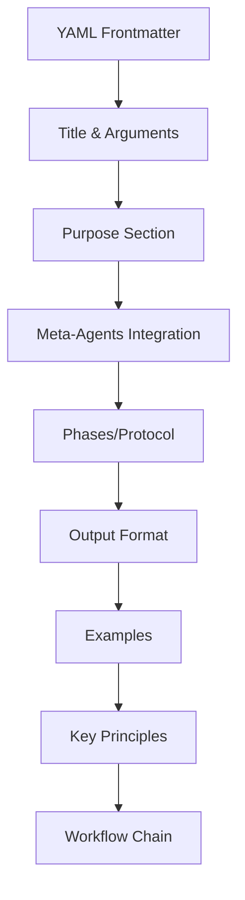

# Workflow Design Guide

> **PikaKit v3.2** | Standard formula for creating new workflows

---

## Workflow Anatomy



---

## Standard Structure

### 1. YAML Frontmatter (REQUIRED)

```yaml
---
description: One-line summary. Action verb + outcome + method.
chain: optional-chain-id  # For auto-chaining
---
```

**Examples:**
- ✅ `Ideation engine with 3+ alternatives analysis.`
- ✅ `Test automation with Vitest/Playwright.`
- ❌ `A workflow for building things` (too vague)

---

### 2. Title & Purpose

```markdown
# /workflow-name - Descriptive Title

$ARGUMENTS

---

## Purpose

[One paragraph explaining what this workflow does and its key differentiator.]
```

---

### 3. Meta-Agents Integration (RECOMMENDED)

```markdown
## 🤖 Meta-Agents Integration

| Phase | Agent | Action |
| ----- | ----- | ------ |
| **Pre-Execute** | `assessor` | Evaluate risk |
| **Execution** | `recovery` | Save checkpoints |
| **Post-Execute** | `learner` | Log patterns |

```
Flow diagram (text or mermaid)
```
```

**Available Meta-Agents:**
- `orchestrator` - Runtime execution control
- `assessor` - Risk evaluation
- `recovery` - State management/rollback
- `critic` - Conflict resolution
- `learner` - Pattern learning

---

## 2️⃣ security-audit Chain

> **Purpose:** Comprehensive security review

### 🔧 Skills (4)

1. `security-scanner` - Vulnerability scanning
2. `code-review` - Security-focused code review
3. `offensive-sec` - Penetration testing
4. `cicd-pipeline` - CI/CD security integration

---

## ⚡ Task-Oriented Workflows (Tactical Layer)

> **Purpose:** High-speed execution for specific tasks. Bypasses deep planning.

| Workflow | Use Case |
| :--- | :--- |
| **`/cook`** | **Implementer:** Execute instructions directly. |
| **`/fix`** | **Mechanic:** Repair specific errors. |

**Characteristics:**
- **Input:** Specific instruction or error (not broad goals)
- **Scope:** Single file/component
- **Overhead:** Minimal (few meta-agents)
- **Speed:** < 2 mins

---

### 4. Phases/Protocol (CORE)

```markdown
## 🔴 MANDATORY: [Protocol Name]

### Phase 1: [Name] (Optional time estimate)
[Clear steps with checkboxes or code blocks]

### Phase 2: [Name]
[Continue pattern...]

### Phase N: [Final Phase]
[Verification/completion criteria]
```

**Design Tips:**
- Use `🔴 MANDATORY` for critical phases
- Include `// turbo` comments for auto-executable steps
- Number phases sequentially
- Each phase should have clear INPUT → OUTPUT

---

### 5. Output Format (REQUIRED)

```markdown
## Output Format

\```markdown
## 🎯 [Workflow Output Title]

### [Section 1]
| Column | Data |
|--------|------|
| Key | Value |

### [Section 2]
[Template content...]

### Next Steps
- [ ] Action item 1
- [ ] Action item 2
\```
```

**Include:**
- Table of findings/decisions
- Actionable next steps
- Status indicators (✅ ❌ ⏳)

---

### 6. Examples

```markdown
## Examples

\```
/workflow-name argument1
/workflow-name complex multi-word argument
/workflow-name subcommand
\```
```

Provide 3-5 realistic examples.

---

### 7. Key Principles (OPTIONAL)

```markdown
## Key Principles

1. **Principle Name** - brief explanation
2. **Another Principle** - brief explanation
```

---

### 8. Workflow Chain (REQUIRED)

```markdown
## 🔗 Workflow Chain

\```mermaid
graph LR
    A["/previous"] --> B["/current"]
    B --> C["/next"]
    style B fill:#10b981
\```

| After /current | Run | Purpose |
|----------------|-----|---------|
| Condition 1 | `/next-workflow` | Reason |
| Condition 2 | `/alternative` | Reason |

**Handoff to /next:**
\```markdown
[Completion message and handoff context]
\```
```

---

## Complete Template

```markdown
---
description: [Action verb] + [outcome] + [method/differentiator].
---

# /workflow-name - Descriptive Title

$ARGUMENTS

---

## Purpose

[What it does. Key differentiator. Integrated agents.]

---

## 🤖 Meta-Agents Integration

| Phase | Agent | Action |
| ----- | ----- | ------ |
| **[Phase]** | `agent` | Action description |

\```
Flow:
step1 → step2
       ↓
step3 → step4
\```

---

## 🔴 MANDATORY: [Protocol Name]

### Phase 1: [Name]
[Steps...]

### Phase 2: [Name]
[Steps...]

---

## Output Format

\```markdown
## [Emoji] [Output Title]

### [Section]
[Content template...]

### Next Steps
- [ ] Action 1
\```

---

## Examples

\```
/workflow-name example1
/workflow-name example2
\```

---

## Key Principles

- **Principle** - explanation

---

## 🔗 Workflow Chain

\```mermaid
graph LR
    A["/previous"] --> B["/workflow-name"]
    B --> C["/next"]
    style B fill:#10b981
\```

| After /workflow-name | Run | Purpose |
|----------------------|-----|---------|
| Condition | `/next` | Reason |

**Handoff:**
\```markdown
Completion message.
\```
```

---

## Checklist

Before publishing a workflow:

- [ ] Frontmatter has clear `description`
- [ ] Purpose section explains the "what" and "why"
- [ ] Meta-agents integrated if workflow is complex
- [ ] Phases are numbered and sequential
- [ ] Output format is copy-paste ready
- [ ] 3-5 examples provided
- [ ] Workflow chain shows before/after connections
- [ ] Handoff message included

---

⚡ PikaKit v3.9.103
Composable Skills. Coordinated Agents. Intelligent Execution.
